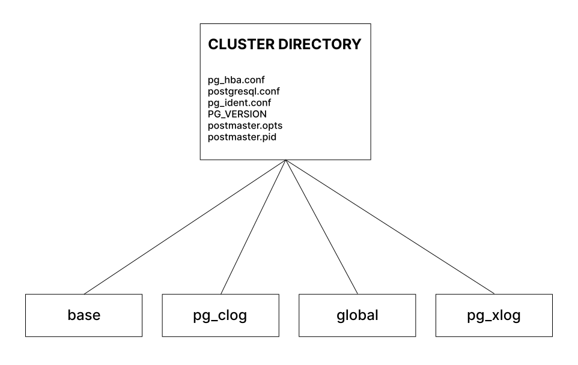
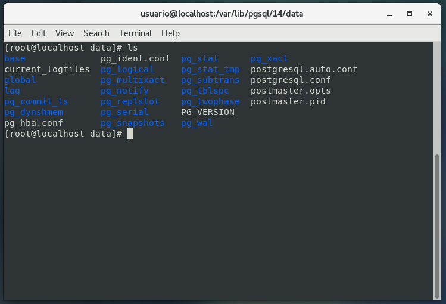
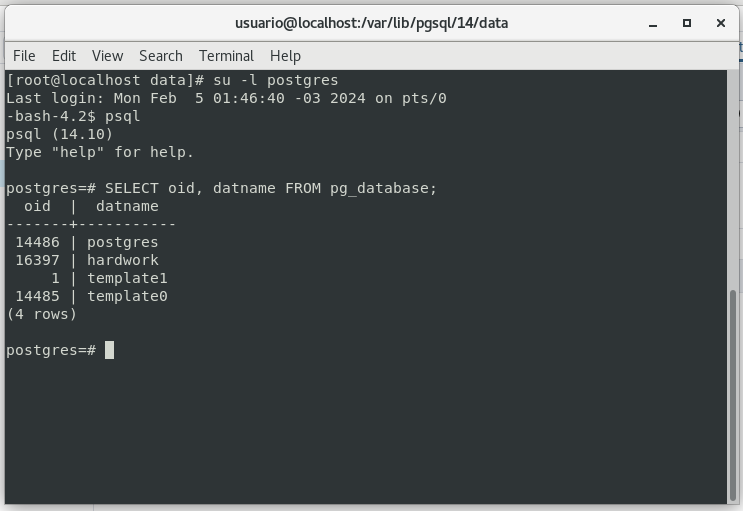
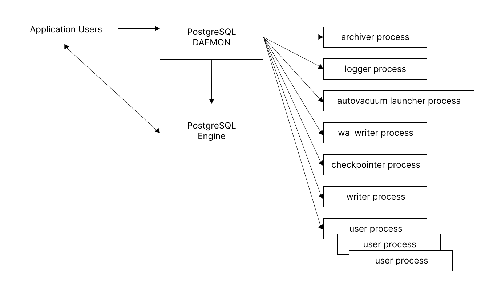

# **Estruturas do PostgreSQL**
## **Estrutura física do PostgreSQL9.4**
Na figura abaixo, visualizamos a estrutura básica do servidor PostgreSQL em sua versão 9.4. Na versão 10, tenciona-se alterar a denominação da localização **pg_xlog** para **pg_wal** além de outras mudanças até chegarmos a versão 14 utilizada instalada para acompanhamento do livro.


<br/>

#### No nível mais alto da hierarquia do PostgreSQL, temos os arquivos de configuração, sendo eles:

- **pg_hba.conf -** Este é o arquivo de configuração para autenticação de usuários. Podemos entender o seu funcionamento como um arquivo **ACL**. Relaciona os **usuários** as **bases de dados**, tipo de **autenticação** e **máscara de rede**;

- **pg_ident.conf -** Usado pelo esquema de autenticação **ident** de **usuários** do **sistema operacional** com **PostgreSQL**, mapeia **usuários** de **sistema** e de **base de dados**, estando por padrão vazio

- **postgresql.conf -** Principal arquivo de configuração do PostgreSQL. Sua lista de parâmetros controlam os aspectos de funcionamento do **cluster**. 

#### Estrutura do diretório data no Postgresql14 em uma instalação RedHat CentOS:


<br/>

#### Breve descrição das principais localizações e arquivos:

- **PG_VERSION -** Contém a versão majoritária do PostgreSQL

- **base -** Armazena por padrão, os arquivos de dados em subdiretórios para cada base. O nome dos subdiretórios referentes às bases de dados do cluster podem ser obtidos consultando a tabela do catálogo **pg_database**:
  ```sql
  SELECT oid, datname FROM pg_database;
  ```
  

- **global -** Contém arquivos com dados dos catálogos (pg_database, pg_class...) e são visíveis globalmente, de todas as bases.

- **pg_multixact -** Subdiretório, conteúdo volátil. Dados relacionados ao estado transacional da base de dados são encontrados aqui; 

- **pg_stat_tmp -** Subdiretório que armazena os arquivos temporários do sistema de estatística. Em casos de gargalo de I/O de disco, uma vez que existe gravação intensiva, eles podem ser transferidos a um RAMDisk.

- **pg_stat (PostgreSQL14) -** Subdiretório contendo arquivos permanentes para o sistema de estatisticas;

- **pg_subtrans -** Subdiretório que contém os dados de estado de subtransações;

- **pg_tblspc -** Subdiretório que contem os **links simbólicos** para as tablespaces;

- **pg_twophase -** Subdiretório que contem os estados para transações do tipo **prepared transactions** 

- **pg_wal -** Subdiretorio que contem os arquivos de **wal** (Write Ahead Log);

- **postmaster.opts** Arquivo que armazena as **opções de linha de comando da última inicialização do cluster**, ou seja é um arquivo que registra as opções de linha de comando com as quais o servidor foi iniciado pela última vez;

- **postmaster.pid -** Arquivo que armazena as informações **PID** e **ID**;

- **postgresql.conf -** Principal arquivo de configuração do cluster;

- **pg_hba.conf -** Arquivo que configura a conexão entre databases e clientes;

- **pg_ident.conf -** Arquivo que relaciona os usuarios as bases de dados, por padrão vazio

## **Estrutura de processos do PostgreSQL9.4**



