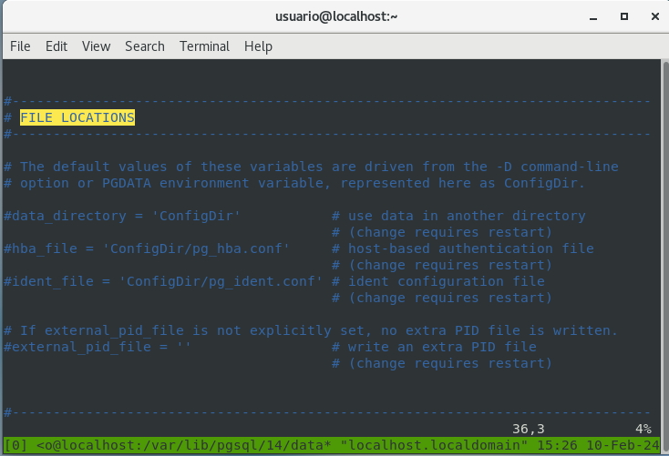
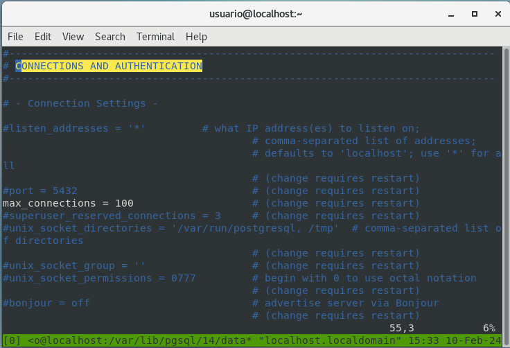
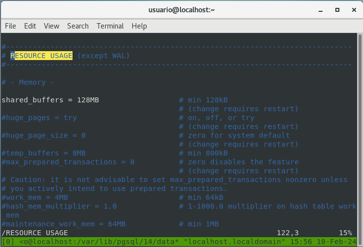
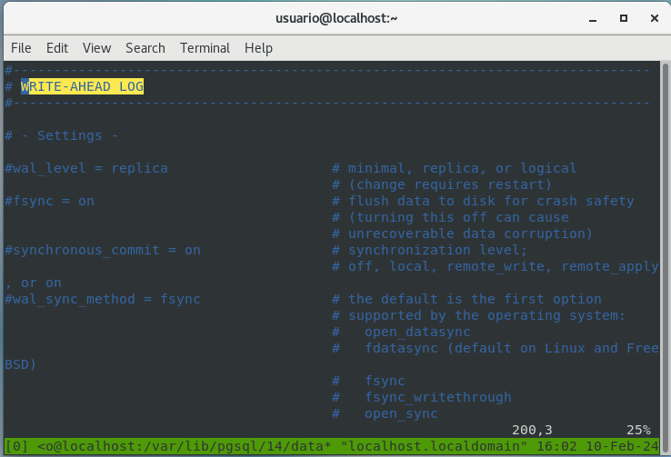
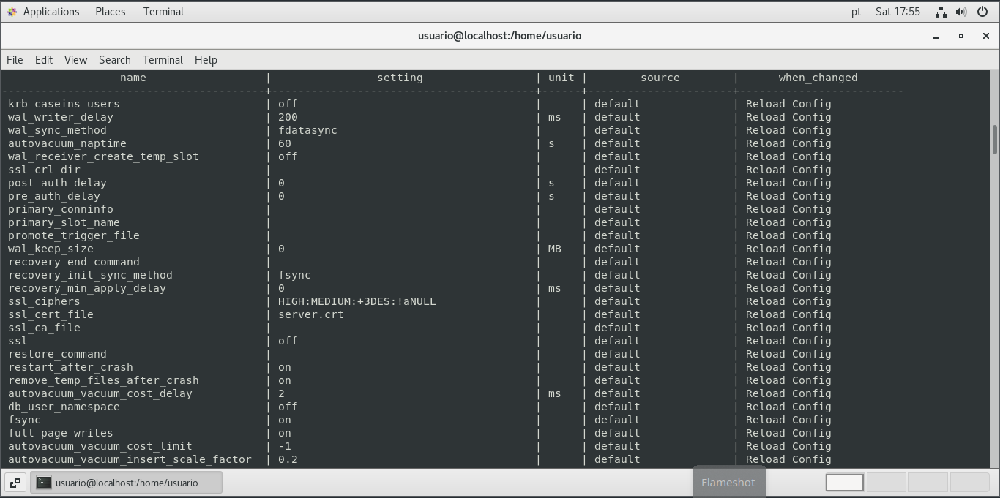
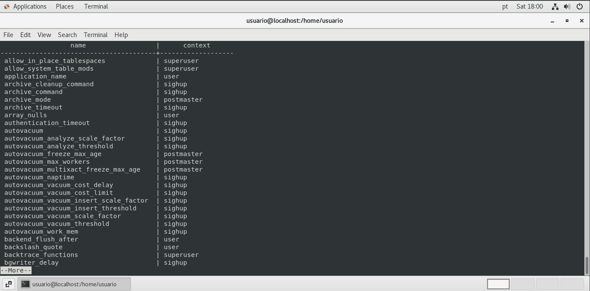

## **Arquivos de configuração**

## **postgresql.conf**<br/>
O principal arquivo de configuração do PostgreSQL, normalmente localizado em **$PGDATA**. Esse arquivo prescreve o comportamento para o cluster inteiro, ou seja, não é possível configurar comportamentos diferentes em relação a cada banco de dados. É necessário ter em mente que a partir da versão 9.4 foi adicionado o **ALTER SYSTEM**, que permite alterar os valores de parâmetros sem modificar o postgresql.conf. Por isso é **recomendado a verificação dos valores do parâmetro do PostgreSQL seja sempre realizada pela view pg_settings**. Os parâmetros ali encontrados dividem-se em várias seções no arquivo:

## **Seções do arquivo postgresql.conf (PostgreSQL14)**

- **CONNECTIONS AND AUTHENTICATION**
- **FILE LOCATIONS**
- **RESOURCE USAGE (except WAL)**
- **WRITE AHEAD LOG**
- **REPLICATION**
- **QUERY TUNING**
- **ERROR REPORTING AND LOGGGING**
- **PROCESS TITLE**
- **RUNTIME STATISTICS**
- **AUTOVACUUM PARAMETERS**
- **CLIENT CONNECTION DEFAULTS**
- **LOCK MANAGEMENT**
- **VERSION/PLATAFORM COMPATIBILITY**
- **ERROR HANDLING**
- **CONFIG FILE INCLUDES**
- **CUSTOMIZED OPTIONS**

**Das seções apresentadas temos algumas a serem observadas**

- **FILE LOCATIONS**<br/>
  Seção onde são definidos localização e nomes de arquivos, como **hba_file**, **ident_file**, **data_directory** entre outros.
  
  

- **CONNECTIONS AND AUTHENTICATION**<br/>
  Seção que define as possibilidades de conexão e autenticação, como porta, protocolo entre outros.
  
  

- **RESOURSE USAGE**<br/>
  Seção que define a utilização de recursos pelo database **memória**, **disco** entre outros.
  
  

- **WRITE-AHEAD LOG**<br/>
  Seção que define as possibilidades de ajuste do **WAL**.
  
  

**Analisando alguns parâmetros do postgresql.conf**

- **max_connection**<br/>
  Número máximo de conexões suportadas pelo cluster. O valor iniicial de max_connection é 100.

- **work_mem**<br/>
  O valor deve ser de até 8MB para servidores com até 32 GB de RAM, 16MB para servidores com até 64 GB de RAM. Se o max_connections for maior que 400, devemos dividir esse valor por 2. O work_men é o espaço utilizado para operações de bitmap, hash join e merge.

- **maintenance_work**<br/>
  Esse parâmetro define o espaço usado pelo VACUUM e CREATE INDEX. O valor default é 64MB.

- **seq_page_cost**<br/>
  Custo estimado de leitura de página em disco para páginas sequenciais, valor default 1.

- **random_page_cost**<br/>
  Custo estimado de leitura de página em disco para páginas não sequenciais, default 4 (quanto mais rápido o disco, ou o uso de SSD, menor pode ser o valor)

## **Alterando os valores dos parâmetros do cluster PostgreSQL**

**Script para saber quais parâmetros necessitam restart para serem alterados.**

A **view** **pg_settings** fornece acesso aos parâmetros de tempo de execução do servidor.

```sql
SELECT 
	name,
	setting,
	unit,
	source,
	CASE context
		WHEN 'postmaster' THEN 'REQUIRES RESTART'
		WHEN 'sighup' THEN 'Reload Config'
		WHEN 'backend' THEN 'Reload Config'
		WHEN 'superuser' THEN 'Reload Config/Superuser'
		WHEN 'user' THEN 'Reload Config/User SET'
	END AS when_changed
FROM pg_settings
WHERE context != 'internal'
ORDER BY when_changed;
```



O **contexto** de cada variável informa-nos da necessidade ou não de reinicialização, alternativamente podemos usar o seguinte comando

```sql
SELECT name, context FROM pg_settings;
```



**Os resultados obtidos na coluna *context* podem ser resumidos em:**

- **INTERNAL**<br/>
  Configurações realizadas em tempo de compilação, não podendo ser alteradas sem a recompilação do servidor.

- **POSTMASTER**<br/>
  É atualizado somente quando um reinício completo do servidor é realizado. Todas as configurações de memória enquadram-se nessa categoria

- **SIGHUP**<br/>
  Enviar ao servidor um sinal HUP fará com que ele recarregue o postgresql.conf, e quaisquer alterações feitas neste parâmetro serão imediatamente ativadas.

- **BACKEND**<br/>
  Semelhantes ao SIGHUP, executando-se pelo fato de que as alterações feitas não afetarão nenhuma sessão de back-end de database já executada, apenas novas sessões iniciadas depois disso sofrerão alterações. Ex: log_connections não pode ser retroativo, para registrar uma conexão ja feita. Somente novas conexões, feitas depois que a log_connections estiver ativa, serão registradas.

- **SUPERUSER**<br/>
  Pode ser executado por qualquer superusuário do banco de dados (em geral, o usuário que criou o banco de dados - normalmente, o “postgres”) a qualquer momento sem se quer exigir uma carga de configuração completa.

- **USER**<br/>
  As sessões de usuários podem ajustar esses parâmetros a qualquer momento. Suas mudanças afetarão apenas essa sessão.

A partir da versão 9.4, foi introduzido o comando **ALTER SYSTEM**, que nos permite alterar parâmetros sem editar o **postgresql.conf**. Quando utilizamos esse comando no mesmo diretório em que se situa o arquivo **postgresql.conf** válido do cluster, é criado o arquivo **postgresql.auto.conf**, que não deve ser editado diretamente e tem a primazia de seu conteúdo em relação ao **postgresql.conf**, mais um motivo para evitar a verificação dos parâmetros do cluster pela leitura do **postgresql.conf** e utilizar a visualização view **pg_settings**. 

Caso seja necessária  a localização dos arquivos, podemos utilizar o seguinte SQL:

```sql
SELECT name, setting FROM pg_settings WHERE category = 'File Locations';
```

[<- ANTERIOR](../capitulo_2/capitulo_2.md)

[PROXIMA ->](../capitulo_4/capitulo_4.md)

[HOME](../README.md)