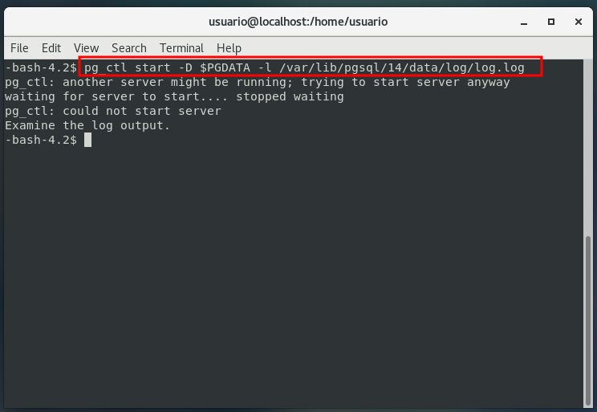
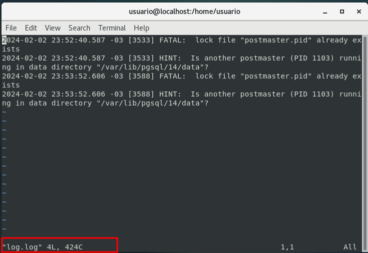
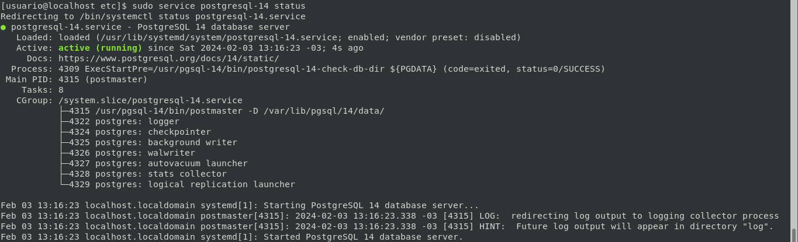
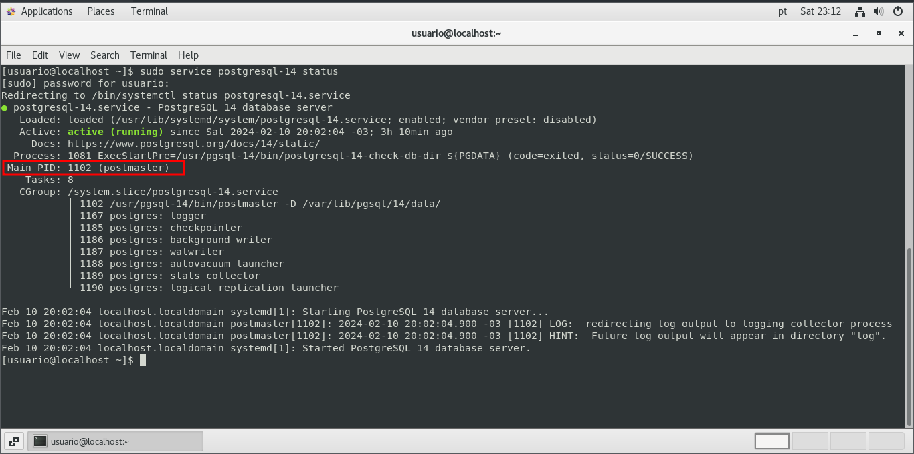
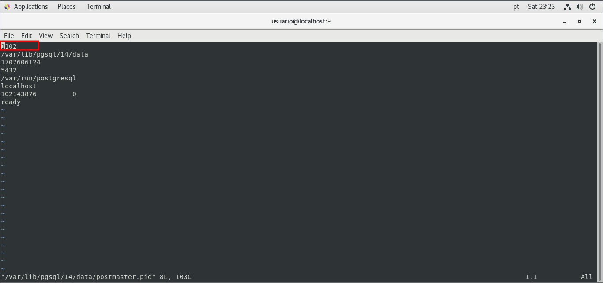

# **Gerenciando o cluster PostgreSQL**

## **Utilitário *pg_ctl***

**pg_ctl** é um utilitário para **inicializar**, **iniciar**, **parar** ou **controlar** um **servidor PostgreSQL**.

**Documentação**

```bash
pg_ctl --help
```

Caso o mesmo não esteja funcionando, talvez seja necessário criar a variável 

**Tratativa para contornar**

- Crie um arquivo em **/etc/profile.d/pgsql.sh**
- Adicione as seguintes informações e salve o arquivo

  ```bash
  #!/bin/bash
  PATH=${PATH}:/usr/pgsql-12/bin
  export PATH
  ```

- Execute esse comando para atualizar o PATH atual
  
  ```bash
  source /etc/profile.d/pgsql.sh
  ```

- Verifique o **PATH** agora

  ```bash
  echo $PATH
  ```

## **Inicialização (startup)**

O **startup** e **shutdown** do cluster PostgreSQL são realizados com o utilitário do **SGBD** chamado **pg_ctl**. Sua sintaxe básica é:

```bash
pg_ctl [start|stop|restart|reload|status] [-D datadir][-o options]
```

Quando o cluster esta em shutdown, desligado, todos os processos postgres desaparecem do servidor e todos os arquivos ficam fechados. 

Observe o comando a seguir:

```bash
pg_ctl start -D $PGDATA
```

Ao executa-lo, os processos do cluster PostgreSQL realizarão a leitura dos arquivos de inicialização **postgresql.conf** e **postgresql.auto.conf**, se houver, e tentarão levantar o cluster em memória, inicializando-o. Caso não seja encontrado o arquivo **postgresql.conf**, uma mensagem de erro será gerada, mas a priori nenhum log padrão será criado, a menos que seja usada a opção **-l** (log filename):

```bash
pg_ctl start -D $PGDATA -l /var/lib/pgsql/14/data/log/log.log
```

Depois disso, o comando verifica as permissões; por exemplo, caso sejam alteradas no diretório **data**, abortará o processo e informará a permissão correta. Na sequência, o comando tentará o arquivo pg_hba.conf; caso não seja encontrado, ou contenha algum erro grave, o cluster enviará uma mensagem de erro e gravará no arquivo de log, efetuando desligamento em seguida.

**Realizando tentativa de *start* com o cluster ja iniciado armazenando retorno de tentativa em arquivo de log**

```bash
pg_ctl start -D $PGDATA -l /var/lib/pgsql/14/data/log/log.log
```



**Acessando arquivo de log gerado**



## **Desligamento (shutdown)**

```bash
pg_ctl stop [-D datadir][-m s[mart]|f[ast]|i[mmediate]]
```

**Os modos de shutdown (stop) disponíveis são: SMART, FAST, IMMEDIATE:**

- **Smart**<br/>
  É a forma padrão (até a versão 9.4) e mais **segura**. Nenhuma nova conexão será permitida, mas todas as conexões atuais poderão ser concluídas normalmente.

  ```bash
  pg_ctl stop -D $PGDATA -m smart
  ```

  Apos parar o serviço é possível validar o *status* com o comando:

  ```bash
  pg_ctl status -D $PGDATA
  ```
  É possível também validar os processos:

  ```bash
  ps auxww|grep ^postgres
  ```

- **Fast**<br/>
  Padrão a partir da versão 9.5. Nenhuma nova conexão será permitida, mas todas as conexões em andamento serão concluídas, inclusive os backups. As transações pendentes sofrerão um ROLLBACK.

- **Imediate**<br/>
  Encerrará todos os processos do servidor abruptamente. Considerada uma forma **extrema** de desligamento, **equivale ao desligamento do host abruptamente**

Os modos **smart** e **fast** são considerados formas de **shutdown** **“limpas”**, **“consistentes”** ou **“regulares”**. A forma imediate é cnsiderada **“irregular”** e pode deixar os databases em um estado não consistente que necessitará de recuperação no modo de inicialização. 

## **Inicialização (startup) e desligamento (shutdown) por customização do sistema operacional e/ou de distribuição**

Distribuições Red Hat (RH), Oracle, CentOS e similares

```bash
sudo service postgresql-x.y[start|stop|restart|reload|status|enable|disable]
```

## **Inicialização (startup)**
  ```bash
  sudo service postgresql-14 start
  ```

Caso apresente o seguinte erro ao tentar executar **start**, **stop**, **status** etc... Pode ser por que o **usuario** em questão nao esta descrito no arquivo **/etc/sudoers**


Basta adicionar o usuário em questão ao arquivo **/etc/sudoers**




Ao utilizar dessa forma no mesmo local do **postgresql.conf** , é criado o arquivo **postgresql.pid**

Validando **PID** apresentado ao executar o comando **sudo service postgresql-14 status** com o apresentado no arquivo **postmaster.pid**

```bash
sudo service postgresql-14 status
```



**Consultado arquivo postmaster.pid**

```bash
sudo vim /var/lib/pgsql/14/data/postmaster.pid
```



## **Parando o cluster com o comando kill**

Embora devamos dar preferência ao gerenciamento do cluster por scripts integrados ao sistema operacional e ao **pg_ctl**, é possível realizar diversos tipos de paradas como o comando **kill** juntamente ao **PID**. Temos, nesse caso, as seguintes opções:

- **SIGHUP**<br/>
  Corresponde ao comando **reload**, sendo aplicado com **kill -1 ou -HUP** . Esse argumento faz o **kill** enviar o sinal **“hang up”** aos processos.

  ```bash
  sudo kill -1 1102
  ```

  ou

  ```bash
  sudo kill -HUP 1102
  ```

- **SIGTERM**<br/>
  Corresponde a parada **smart**, sendo aplicado **kill -15 ou -TERM** . Esse é o valor **default** do comando **kill** que pode ser aplicado também com **killiall** . É considerado **seguro** em termos de pequeno risco de perda de dados.

  ```bash
  sudo kill -15 1102
  ```

  ou 

  ```bash
  sudo kill -TERM 1102
  ```

- **SIGINT**<br/>
  Corresponde á parada **fast**, sendo aplicado com **kill -2 ou -SIGINT**. Este comando forçará a parada do processo. Ainda é considerado seguro, uma vez que desconectará e realizará **roolback** em qualquer transação não concluída, com exceção de transações **P2C**.

  ```bash
  sudo kill -2 1102
  ```

  ou 

  ```bash
  sudo kill -SIGINT 1102
  ```

- **SIGKILL**<br/>
  Corresponde à parada *imediate*, sendo aplicado com **kill -9** ou **-KILL**. O **kernel** liberará o processo sem informar o processo dele. Deve ser utilizado apenas se não houver sido possível parar os processos de outra forma. É o comando que acarreta maior risco de perda de dados.

  ```bash
  sudo kill -9 1102
  ```

  ou

  ```bash
  sudo kill -SIGKILL 1102
  ```

<br/>

[<<==](../capitulo_3/capitulo_3.md) |====| [Home](../README.md) |====| [==>>](../capitulo_5/capitulo_5.md)