# **Gerenciando as estruturas físicas e lógicas**

<br/>

## **pg_xlog (pg_wal PostgreSQL14)**

Os arquivos de **WAL** são gerados no diretório **pg_wal** (a partir da versão 10). O **pg_wal** geralmente sofre gravação contínua, sendo um tunning de natureza quase obrigatória na maioria das instalações movê-lo para outro **filesystem** basta substituir seu diretório por um link simbólico para o ponto de montagem, onde o usuário **owner deve ser o postgres**.

**Alguns cuidados devem ser observados, como as necessidades do PostgreSQL estar parado e da realização de cópia do conteúdo do atual pg_wal para o novo dispositivo - lembrando que pode implicar um alto risco de perda de dados se não for feita corretamente.**

<br/>

## **Alterando a localização do pg_wal**

- **Parar o cluster em execução, por exemplo:**

  ```bash
  pg_ctl -D /var/lib/pgsql/14/data/ stop -m f
  ```

  ou

  ```bash
  pg_ctl -D $PGDATA stop -m f
  ```

  ou 

  ```bash
  sudo service postgresql-14 stop
  ```

- **Criar um novo diretório**
  
  ```bash
  mkdir /temp_pg_wal
  ```

- **Copiar os arquivos e diretórios existentes para o novo diretório do ponto de montagem**

  ```bash
  cp -rf /var/lib/pgsql/14/data/pg_wal/* /var/lib/pgsql/14/data/temp_pg_wal
  ```

- **Criar um link simbólico para o novo diretório renomeando o diretório existente**

  ```bash
  cd /var/lib/pgsql/14/data
  ```

  ```bash
  mv pg_wal pg_wal_bkp
  ```

  **criando link**

  ```bash
  ln -s ~/temp_pg_wal/ pg_wal
  ```

- **Iniciar o cluster**
  ```bash
  pg_ctl -D $PGDATA start
  ```

  **O serviço do PostgreSQL não iniciou, após análise foram identificadas divergências na criação do diretório** ⚠️ 

  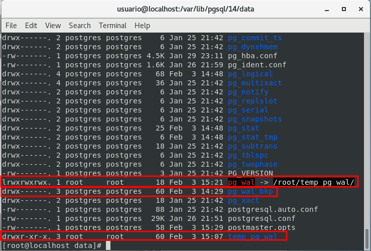

**Correção**

- **Realizado login com usuário *postgres***

  ```bash
  su
  ```

  ```bash
  su -l postgres
  ```

- **Excluído link criado anteriormente com usuário root e com apontamento errado**<br/>
  
  **OBS:** Poderia apenas alterar as pormissões e setado usuario:grupo, porém como o mesmo estava com o diretório incorreto, removi e criei novamente. 

  ```bash
  rm pg_wal
  ```
- **Criando novamente**

  ```bash
  ln -s ~/14/data/temp_pg_wal/ pg_wal
  ```

  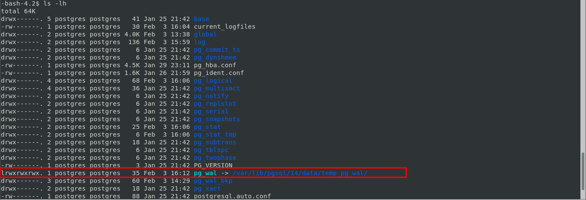

- **Iniciando novamente o serviço**
  ```bash
  pg_ctl -D $PGDATA start
  ```

  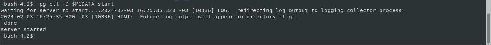

- **Validando status**
  ```bash
  pg_ctl -D $PGDATA start
  ```

  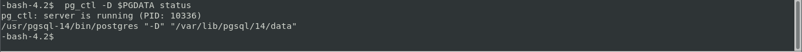

  **OBS:** porém de inicio não conseguia validar o status do serviço através do comando **sudo service postgresql-14** status ou **pg_ctl -D $PGDATA status** reiniciei o cluster analizei os logs e tentei novamente porém ainda não consegui, foi necessáro reiniciar a **vm** , e após reiniciar a **vm**  consegui consultar normalmente. ⚠️ 

<br/>

## **Tablespaces**

O conceito de tablespace diz respeito a **possibilidade de criar áreas em outros diretórios em que seja possível direcionar objetos (tabelas, índices etc.)** e, com isso, ter melhor gerenciamento de distribuição de carga por vários discos diferentes.

A **tablespace** pode estar localizada em qualquer diretório desde que a propriedade seja do usuário **postgres**. Ao DBA cabe identificar os objetos que têm muito acesso ou necessidades especiais de armazenamento, ou seja, candidatos naturais a armazenamento em tablespaces.

Por padrão, todos os objetos e dados são armazenados na tablespace padrão, **pg_default**.

 ### **Definindo uma tablespace**

  Os diretórios devem existir previamente, tendo sido criados por usuarios do sistema operacional, e ser de propriedade do usuário postgres.
  
```bash
mkdir tablespaces
```
 
```bash
sudo chown -R postgres:postgres tablespaces
```

```sql
CREATE TABLESPACE fastspace LOCATION '/usr/tablespaces/fastspace';
```

### **Excluindo uma tablespace**
  
```sql
DROP TABLESPACE fastspace
```

### **Além de criar e eliminar tablespaces, podemos defini-las como "default" para um determinado usuário, com comando:**

```sql
ALTER USER <name_user> SET default_tablespace='name new tablespace';
```

<br/>

## **Instalando a ferramenta pgAdmin4**

- [**Download pgAdmin4**](https://www.pgadmin.org/download/pgadmin-4-rpm/ "Download pgAdmin4")

### **Criando nova conexão com os dados do servidor**

  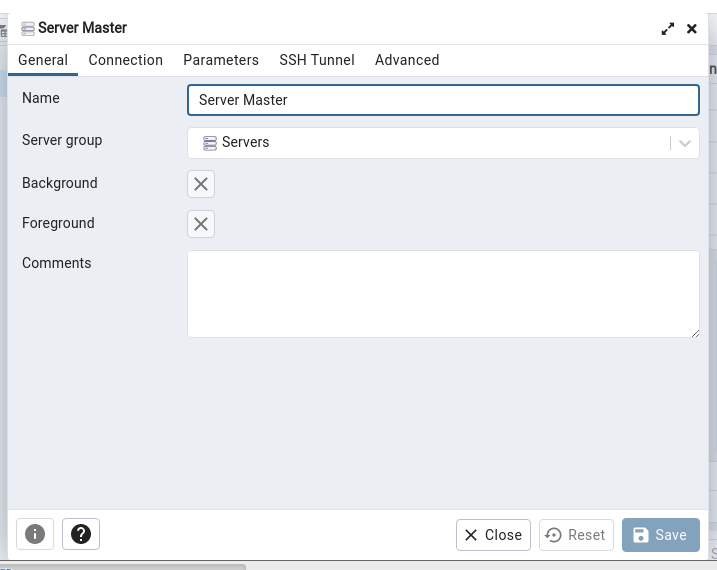

  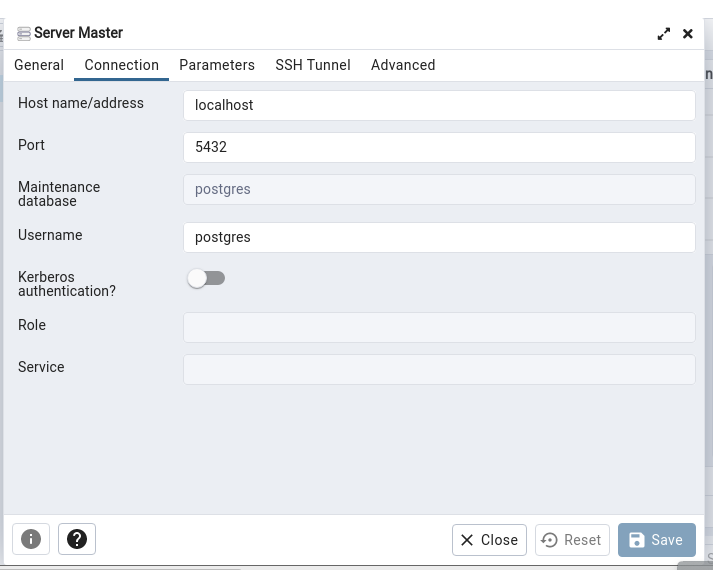

### **Interface pgAdmin4**

  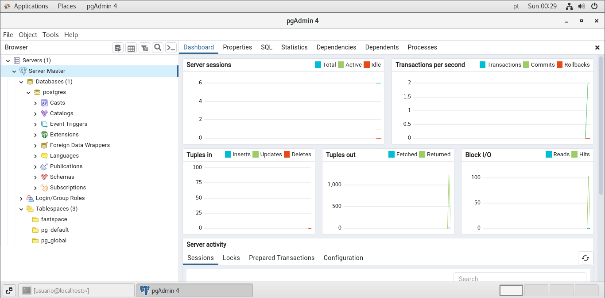

Agora será crada uma **role** . Nesse instante, será gerado um usuário com privilégios para criação de database. Em seguida, será desenvolvido um database, um schema para melhor organização e algumas tabelas.

- **Status atual**
  
  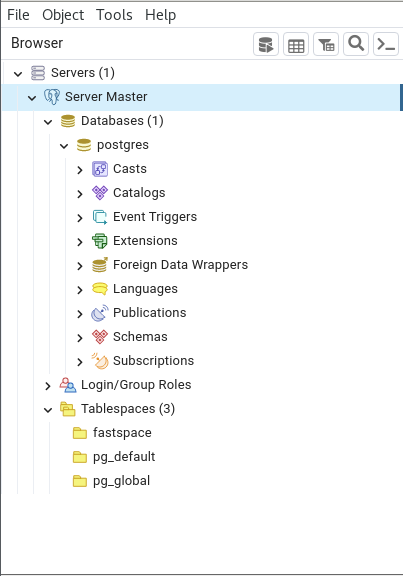

- **Estudo de caso**

  Desenvolvendo a estrutura para o database HardWork, de uma empresa de hardware e software. Iniciando com a criação do usuário (role) **hw**.

  ```sql
  CREATE ROLE hw WITH LOGIN PASSWORD '<senha>' CREATEDB CREATE ROLE;
  ```

  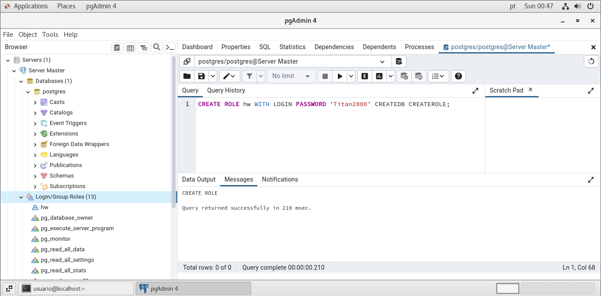

Após criada role **hw**, sairemos do editor e entraremos novamente como role (usuário) **hw**. Feito isso desenvolveremos o novo database **HardWork**, um novo schema **rh** e as tabelas **rh.empleyees** e **rh.departments**:

- **Criando database**
  
  ```sql
  CREATE DATABASE HardWork;
  ```

- **Criando schema**

  ```sql
  CREATE SCHEMA rh;
  ```

- **Criando tabela employees**
  
  ```sql
  CREATE TABLE rh.employees (
    employee_id SERIAL,
    employee_name VARCHAR(20),
    department_id VARCHAR(10),
    salary INT
  );
  ```

- **Inserindo dados na tabela employees**

  ```sql
  INSERT INTO rh.employees VALUES 
    (100, 'Thomas', 1001, 5000),
    (101, 'Jason', 1001, 5500),
    (102, 'Mayla', 1001, 7000),
    (103, 'Nisha', 1002, 9500),
    (104, 'Randy', 1003, 6000),
    (105, 'Bruce', 1003, 6000),
    (106, 'John', 1004, 6050),
    (107, 'Chen', 1004, 6000),
    (108, 'Diana', 1005, 5000),
    (109, 'Peter', 1005, 5000),
    (110, 'Adam', 1005, 5000),
    (111, 'Payam', 1005, 4500),
    (112, 'Kevin', 1001, 4800);
  ```

- **Criando tabela departments**
  
  ```sql
  CREATE TABLE rh.departments (
    department_id SERIAL,
    department_name VARCHAR(20)
  );
  ```

- **Inserindo dados na tabela departments**
  
  ```sql
  INSERT INTO rh.departments VALUES 
    (1001, 'IT'),
    (1002, 'Administration'),
    (1003, 'Marketing'),
    (1004, 'Sales'),
    (1005, 'Human Resourses');
  ```

<br/>

## **Criando tablespace de dados**

A **tablespace** padrão é a **pg_default** , default em template1 e template0. Será, portanto, a área de tabela padrão para outros databases, a menos que outra seja definida, por exemplo, com a cláusula **TABLESPACE** em **CREATE DATABASE**.

- **A localização da pg_default pode ser encontrada por meio da seguinte consulta no database PostgreSQL:**
  
  ```sql
  select setting||'/base' from pg_settings where name='data_directory';
  ```

  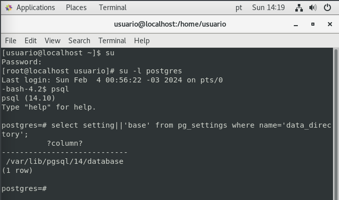

  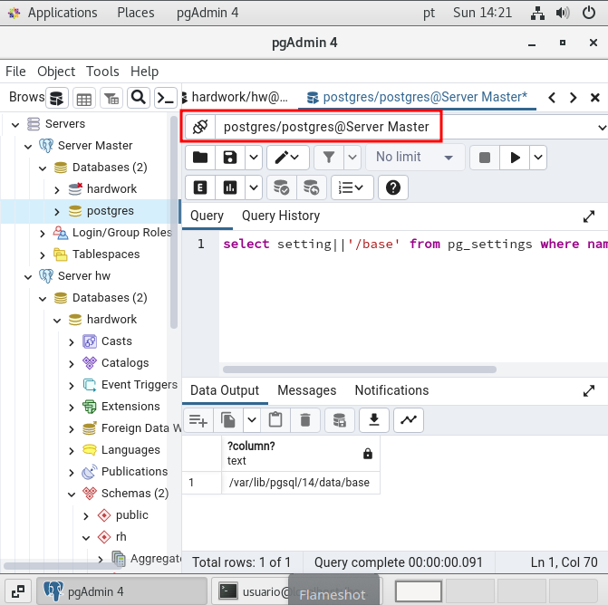

No exemplo citado acima, a localização de pg_default é **/var/lib/pgsql/14/data/base** para pequenas instalações em apenas um file system (em computação, um file system (sistema de arquivos) é usado para controlar o modo como os dados são armazenados e recuperados) isso não é um problema, mas para grandes sistemas, com diversas tabelas e índices, pode causar transtornos com concorrência de discos e segurança e crescimento excessivo de alguma área, prejudicando todo o cluster. Por essas razões, é sempre interessante **desmembrar** dados, **índices**, arquivos **temporários** e arquivos de **log**.

### **Para criação de uma tablespace como visto anteriormente podemos fazer o seguinte:**

- **Deletando tablespace criada anteriormente**
  
  ```sql
  DROP TABLESPACE fastspace;
  ```

- **Criando novo diretório**
  
  ```bash
  mkdir pg_tbs_hw
  ```

- **Ajustando owner, grupos e permissões**

  ```bash
  chown postgres pg_tbs_hw
  ```

  ```bash
  chgrp postgres pg_tbs_hw
  ```

  ```bash
  chmod 700 pg_tbs_hw
  ```

- **Para criar a role, é necessário ser SUPERUSER. Caso se queira utilizar o user hw como postgres, faremos esta execução:**

  ```sql
  ALTER USER hw SUPERUSER;
  ```

- **Criando nova tablespace**
  
  ```sql
  CREATE TABLESPACE tbs_hw LOCATION '/usr/tablespaces/pg_tbs_hw';
  ```

- **Movendo tabelas para outra tablespace**

  O cluster pode crescer e necessitar uma melhor organização física. Nesses casos, podemos mover tabelas de uma tablespace para outra.

  No exemplo a seguir, criaremos scripts que devem alterar a tablespace de todas as tabelas do schema rh.

  ```sql
  SELECT 'ALTER TABLE '|| table_schema || '.' || table_name || ' SET TABLESPACE tbs_hw;'
  FROM information_schema.tables
    WHERE table_schema = 'rh'
    ORDER BY table_name;
  ```

  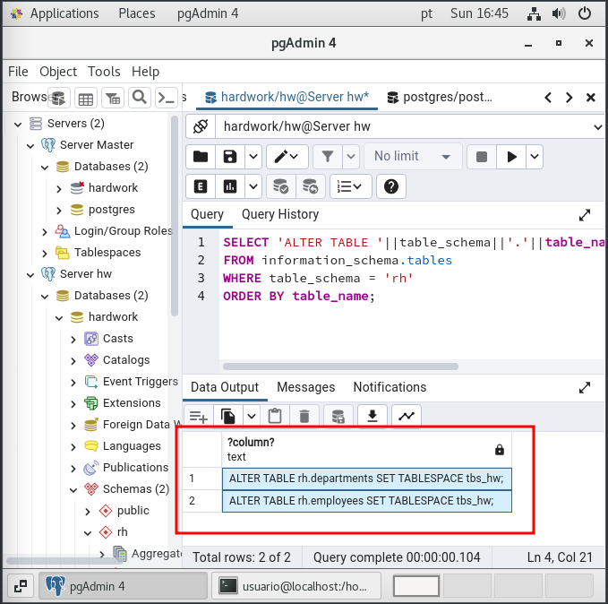

  Copiado **script** gerado para nova aba, e realizado a remoção das aspas duplas, e em seguida executado o mesmo.

  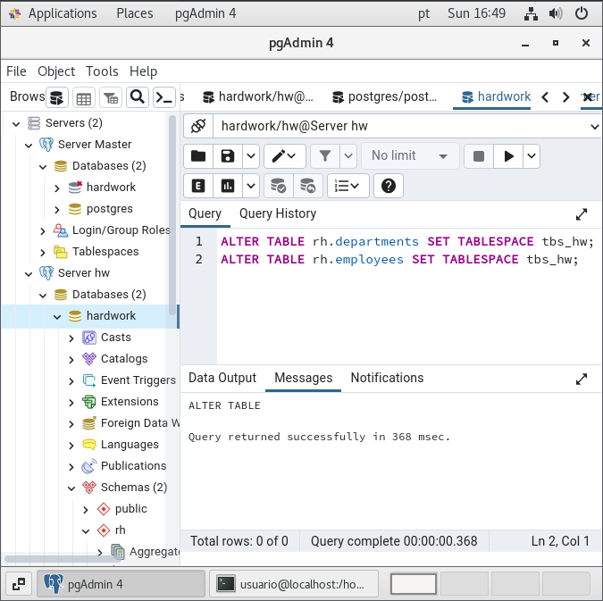

- **Também podemos realizar o mesmo processo com os índices e, dessa forma, melhorar o acesso ao disco e a organização. Para isso, podemos criar scripts que devem alterar a tablespace de todos os índices do schema determinado.**

  ```sql
  SELECT 'ALTER INDEX '||schemaname||'.'||indexname||' SET TABLESPACE tbs_hw_indices;'
  FROM pg_catalog.pg_indexes
    WHERE schemaname = 'pagila' AND TABLESPACE IS NULL
    ORDER BY tablename;
  ```

<br/>

[**<<==**](../capitulo_4/capitulo_4.md) |====| [**Home**](../README.md) |====| [**==>>**](../capitulo_6/capitulo_6.md)