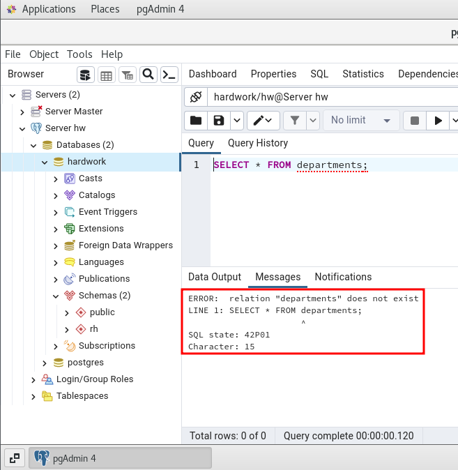
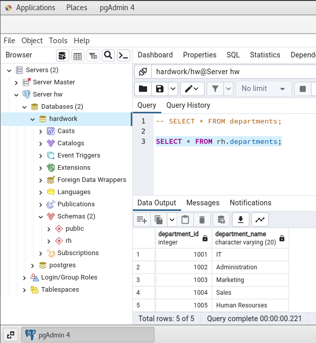
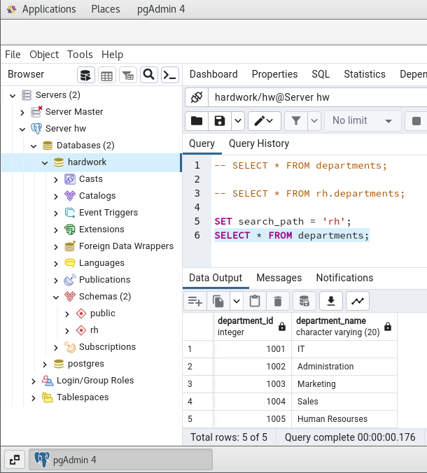
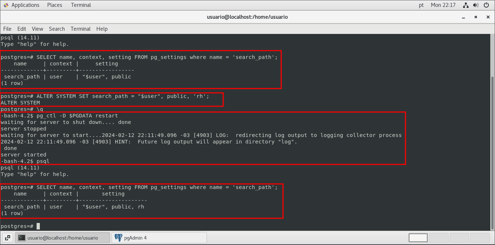

# **Criando e organizando databases**

<br/>

## **Base de dados (databases)**

São as maiores entidades lógicas do **cluster PostgreSQL**; todas as demais entidades lógicas estarão contidas nos **databases** . **O conceito de cluster (agrupamento) no PostgreSQL dá-se pelo fato deste conter diversos databases na mesma máquina**.

Ao contrário da **tablespace**, que é uma estrutura **física**, o **database é uma estrutura lógica que pode estar em uma ou várias tablespaces**.

A criação de um database deve ser realizada por um **superuser**, com permissão para tanto, com o comando:

```sql
CREATE DATABASE <name>;
```

Nesse caso o **owner** (dono) será o usuário que criou, mas é possível mudar isso usando o mesmo comando:

```sql
CREATE DATABASE <name> OWNER <user>;
```

Ao criar o cluster, automaticamente três databases são criados (**postgres, template0 e template1**). O **template0** e o **template1** são utilizados como modelos nas criações dos demais databases.

O comando resumidamente é:

```sql
CREATE DATABASE name
[[WITH][OWNER[=]user_name]
[TEMPLATE[=]template]
[ENCODING[=]encoding]
[LC_COLLATE[=]lc_collate]
[LC_CTYPE[=]lc_ctype]
[TABLESPACE[=]tablespace_name]
[CONNECTION LIMIT[=]connlimit]]
```

<br/>

## **Schemas**

Os schemas **são subdivisões lógicas dos databases, similares aos diretórios**. Não podem ser alinhadas, também não é possível ter schemas dentro de schemas. Sua finalidade é separar objetos de aplicações diferentes ou de natureza diversa, **com o intuito de melhorar a organização da estrutura do database**.

### **Comando para criação de um schema**

```sql
CREATE SCHEMA <name>;
```

O schema padrão dos databases é o **public** . Ao criar um schema, necessitamos prefixar seu nome ao objeto que queremos acessar. Podemos evitar a prefixação configurando o **seach_path**.

```sql
SET search_path = '<name_schema>';
```

### **É possível realizar essa configuração em vários níveis**

- **Nível do cluster**<br/>
  ```sql
  ALTER ROLE <user> SET search_path = '<schema1>, <schema2>...<schemaN>';
  ```

- **Nível de seção**
  ```sql
  SET search_path = '<name_schema>';
  ```

<br/>

**Com nosso usuário criado anteriormente ao tentarmos realizar uma consulta em uma tabela fora do schema public será retornado o seguinte erro:**



**É possível então realizar a consulta das seguintes formas:**

- **Com a prefixação do schema**
  
  ```sql
  SELECT * FROM rh.departments;
  ```

  

- **Configurando o path na seção**
  ```sql
  SET search_path = 'rh';
  ```
  

- **Configurando postgresql.conf, através do search_path**

  Neste exemplo foi utilizado o **ALTER SYSTEM** mensionada nos capítulos iniciais.

  

  **Consultando novemente após alteração:**

  

<br/>

## **Índices**

Índices são estruturas que podem auxiliar a pesquisa e localização de dados, **diminuindo o tempo de busca**, encontrando as páginas onde os dados procurados estão situados, funcionando como ponteiro para uma localização.

O padrão do PostgreSQL é criar índices do tipo B-tree (**binary tree - árvore binária**). Sua criação pode ser realizada com o comando:

```sql
CREATE INDEX idx_nome_indice ON tabela_nome (coluna a, coluna b, ... coluna n);
```

**A sintaxe completa é:**

```sql
CREATE [UNIQUE]INDEX[CONCURRENTLY][name]ON table_name[USING method]
({column_name|(expression)}[COLLATE collation][opclass][ASC|DESC][NULLS]{FIRST|LAST}][,...])
[WITH(storage_parameter = value[,...])]
[TABLESPACE tablespace_name]
[WHERE predicate]
```

A criação de índices é uma operação laboriosa para o database. Durante ela, é realizada uma operação de **lock** na tabela, o que pode **inviabilizar a geração de índices no decorrer da atividade em produção de um sistema**. Como alternativa, **temos a opção CONCURRENTLY, que não realiza o lock, mas demanda mais tempo em sua execução**.

**Para remover um índice**

```sql
DROP INDEX idx_nome_indice;
```

É possível criar o índice em uma coluna e **definir a ordem em que os dados são arranjados**. Assim quando ocorrer uma relação com a cláusula **“order by”** sobre a coluna indexada, os dados retornam já organizados e o otimizador de consultas ignora o passo de ordenação.

```sql
CREATE INDEX idx_nome_indice ON tb_tabela(coluna x DESC NULLS FIRST);
```

**Também é possível recriar os índices com os comandos:**

```sql
REINDEX{INDEX|TABLE|DATABASE|SYSTEM}name[FORCE]
```

```sql
REINDEX[(VERBOSE)]{INDEX|TABLE|SCHEMA|DATABASE|SYSTEM}name
```

Contudo, esse procedimento produz **lock** de tabela durante sua execução. Existe ainda um utilitário **reindexdb** executado diretamente pelo sistema operacional.

<br/>

## **Roles**

O PostgreSQL tem um sistema de roles em que usuários e agrupamentos de privilégios são na verdade, roles.

O PostgreSQL gerencia permissões de acesso ao banco de dados usando o conceito de roles. Uma role pode ser considerada como um usuário do database ou um grupo de usuários, dependendo de como a role é configurada. As roles podem possuir objetos (por exemplo, tabelas) e podem atribuir privilégios sobre esses objetos e a outras roles para controlar quem tem acesso a quais objetos. O conceito de roles integra os conceitos de **“usuários”** e **“grupos”**.

Por motivos de compatibilidade com versões anteriores é possível usar o seguinte comando para criar uma role/usuario:

```sql
CREATE USER [NAME];
```

**Porém é aconselhavel dar preferencia ao comando:**

```sql
CREATE ROLE [NAME] LOGIN;
```

**Para criação de roles que são usuários, existem algumas observações**

- Para gerar um superusuário, temos que adicionar o comando **SUPERUSER** e ser superusuários, devemos adicionar privilégio de **CREATEROLE**; e para criação de novos databases, precisamos de privilégio de **CREATEDB**. Para gerenciar a replicação ou utilizar o comando pg_basebackup, é necessário privilégio **REPLICATION**.

- A role, usuário, que cria um objeto terá todos os privilégios sobre ele (**leitura**, **execução**, **deleção**, **inclusão** etc). Os superusuários têm todos os privilégios sobre todo e qualquer objeto do cluster. Por várias razões, é comum termos de conceder privilégios a outras roles, o que é feito com o comando **GRANT**:
  ```sql
  GRANT[PRIVILEGIOS]ON[OBJETO]TO[ROLE];
  ```

Da mesma forma que podemos necessitar conceder privilégios, podemos precisar revogar esses direitos concedidos. Isso é feito com o comando **REVOKE**.

```sql
REVOKE[PRIVILEGIOS]ON[OBJETO]FROM[ROLE];
```

**Possíveis priviégios:**

- SELECT
- INSERT
- UPDATE
- DELETE
- TRUNCATE
- REFERENCES
- TRIGGER
- CREATE
- CONNECT
- TEMPORARY (TEMP)
- EXECUTE
- USAGE
- ALL PRIVILEGES

<br/>

[**<<==**](../capitulo_5/capitulo_5.md) |====| [**Home**](../README.md) |====| [**==>>**](../capitulo_7/capitulo_7.md)