# **Volumetria e disponibilidade**

<br/>

Ao abordar monitoramento no PostgreSQL geralmente são referidos dois tipos que são eles **contínuo** e **pontual**.

## **Monitoramento pontual**

* **Uptime**<br/>
  Tempo em que a base de dados está disponível, o mesmo pode ser obtido através do log (local definido em log_directory no arquivo postgresql.conf) ou através da função **pg_postmaster_start_time()** que retorna, o momento, data e hora do start da base de dados:

  ```sql
  SELECT date_trunc('hour', pg_postmaster_start_time() as start_date, date_trunc('second', current_timestamp - pg_postmaster_start_time)) as uptime;
  ```

  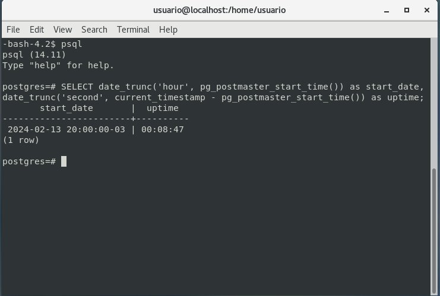

- **Variação do tamanho da base**<br/>
  O tamanho da base de dados pode ser analisado com a seguinte consulta

  ```sql
  SELECT pg_size_pretty(sum(pg_database_size(oid))::BIGINT) FROM pg_database;
  ```
  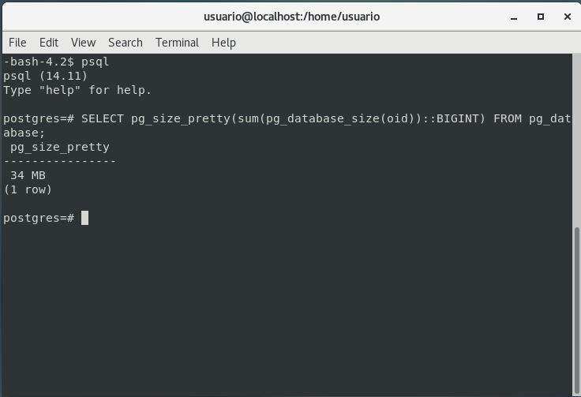

- **Número total de conexões**<br/>
  Para verificar o quão próximo o número de conexões esta de atingir o limite

  ```sql
  SELECT count(*) as total_conn FROM pg_stat_activity;
  ```

  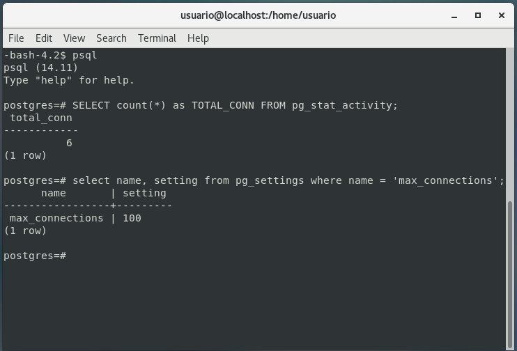

- **Monitoramento de usuários/sessões do cluster**<br/>
  Com **pg_stat_activity**, podemos monitorar as conexões ao cluster

  ```sql
  SELECT datid, datname, pid, application_name FROM pg_stat_activity;
  ```

  É possível repetir o select com \watch x; sendo **x** o número de segundos entre os intervalos de consulta

  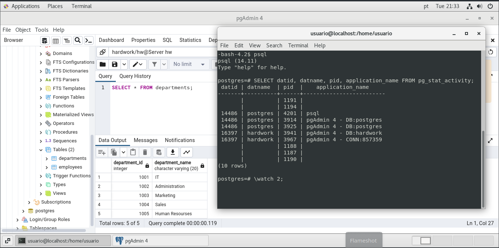

<br/>

## **Eliminação de seções no cluster**

Por diversos motivos (execução de comandos muito demorados, locks em outras sessões etc...), podemos ter a necessidade de eliminar uma sessão. Uma boa prática é cancelar o comando SQL antes de tal eliminação. Isso pode ser realizado com a função **pg_cancel_backend(pid);** caso não seja possível, utilizamos a função **pg_terminate_backend(pid)**, como no exemplo a seguir:

```sql
SELECT datid, datname, pid, application_name FROM pg_stat_activity;
```

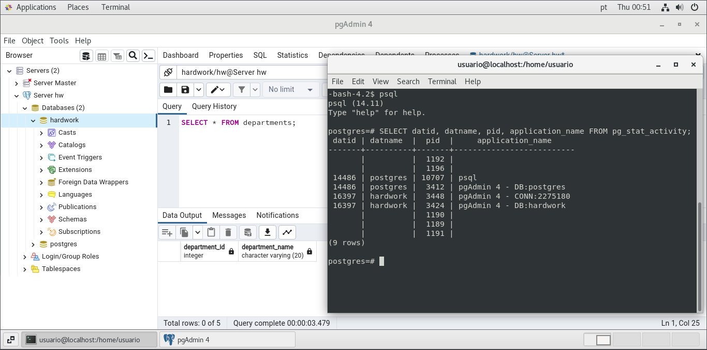

Encerrando as conexões com pid 3448 e 3424 correspondente as operacoes que estavam sendo realizadas com pgAdmin4 na base hardwork

```sql
SELECT pg_terminate_backend(3424);
```

```sql
SELECT pg_terminate_backend(3448);
```

Após encerramento ao tentar dar continuidade no pgAdmin4 o mesmo apresentou aviso relacionado a perca de conexão:

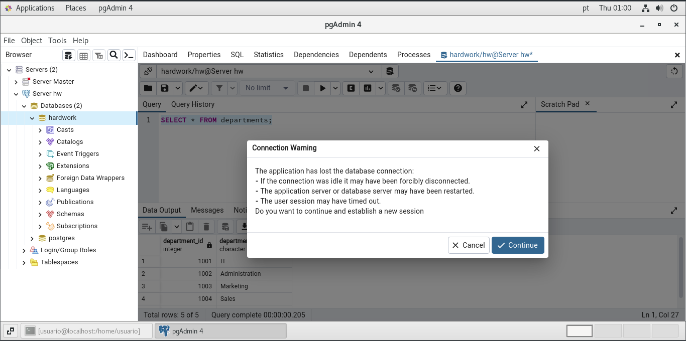

Em algumas situações, caso o procedimento falhe, é possível utilizar o comando citado anteriormente KILL -9:

```bash
kill -9 3424
```

<br/>

## **Monitoramento de execução pontual de queries**

Para realizar o monitoramento pontual dos comandos, queries, que estão sendo executados no cluster, é possível utilizar o seguinte comando:

```sql
SELECT datname, usename, pid, state, query FROM pg_stat_activity;
```

Como se trata de uma base que nao esta em produção, após executar a consulta citada acima, em seguida digitar o comando **\watch 2;** para que a mesma execute a cada 2 segundos é possível ver a mesma consulta sendo executada repetidas vezes:

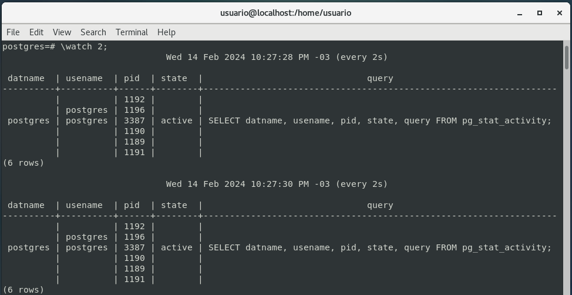

### **A querie pode apresentar os seguintes states:**

- **Active**<br/>
  O processo ***back-end*** esta executando uma query - está ativo.

- **Idle**<br/>
  O processo está aguardando um novo comando de cliente - está ocioso.

- **Idle in transaction**<br/>
  O processo esá em uma transação mas não está executando uma query.

- **Idle in transaction (aborted)**<br/>
  Este estado é semelhante ao ***idle in transaction*** exceto quando uma das instruções na transação causou um erro.

- **Fastpath function call**<br/>
  O processo esta executando uma ***fast-path function***.

- **Disabled**<br/>
  Este estado é relatado se as ***track_activities*** estiverem desabilitadas nesse processo.

É possível utilizar-se dessas informações para filtrar por exemplo as queries que estão ativas:

```sql
SELECT datname, usename, query FROM pg_stat_activity WHERE state = 'active';
```

Caso queira mais especificamente filtrar as queries que apresentam mais demora/lentidão na execução, é possível executar a seguinte consulta:

```sql
SELECT 
  current_timestamp-query_start AS runtime,
  pid,
  query_stat,
  datname,
  usename,
  query
FROM pg_stat_activity
WHERE state = 'active'
ORDER BY 1 DESC;
```

Ou mais especifico ainda, queries que estão demorando mais que um determinado tempo de execução:

```sql
SELECT 
  current_timestamp-query_start AS runtime,
  pid,
  query_start,
  datname,
  usename,
  query
FROM pg_stat_activity
WHERE state = 'active'
AND current_timestamp-query_start > '2min'
ORDER BY 1 DESC;
```

<br/>

## **Monitoramento de queries ativas ou bloqueadas**

Uma query ativa a muito tempo pode estar esperando algum recurso ou bloqueada, aguardando um registro retido por outra sessão.

- **Abriremos uma sessão e rodaremos uma consulta que deve aguardar alguns minutos para executar:**

  ```sql
  SELECT pg_sleep(300);
  ```

- **Agora verificaremos o que está rodando e qual o seu state**
  ```sql
  SELECT current_timestamp-query_start AS runtime, pid, datname, usename, query, state FROM pg_stat_activity;
  ```

  É possível observar que a query está aguardando o final do tempo, e seu estado é **active**.

  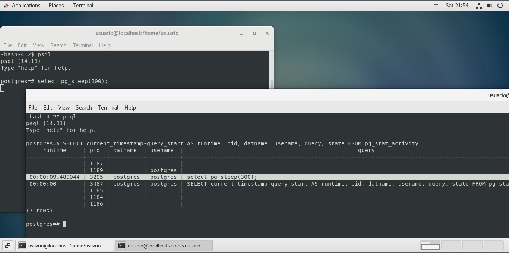

  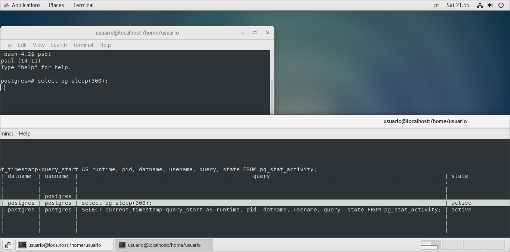

<br/>

## **Monitoramento simultâneo de sessões bloqueadas e bloqueadoras**

Uma causa de lentidão e problemas são bloqueios demorados, para saber inofrmações como quem está bloqueando e quem está sendo bloqueado, duração e impacto é possível utilizar a seguinte consulta:

```sql
SELECT
  kl.pid AS bloqueador_pid,
  ka.usename AS bloqueador_user,
  ka.query AS bloqueador_query,
  bl.pid AS bloqueada_pid,
  a.usename AS bloqueada_user,
  a.query AS bloqueada_query,
  to_char(age(now(), a.query_start),'HH24h:MIm:SSs') AS duracao_bloqueio
FROM pg_catalog.pg_locks bl
JOIN pg_catalog.pg_stat_activity a ON bl.pid = a.pid
JOIN pg_catalog.pg_locks kl ON bl.locktype = kl.locktype
  AND bl.database IS NOT DISTINCT FROM kl.database
  AND bl.relation IS NOT DISTINCT FROM kl.relation
  AND bl.page IS NOT DISTINCT FROM kl.page
  AND bl.tuple IS NOT DISTINCT FROM kl.tuple
  AND bl.virtualxid IS NOT DISTINCT FROM kl.virtualxid
  AND bl.transactionid IS NOT DISTINCT FROM kl.transactionid
  AND bl.classid IS NOT DISTINCT FROM kl.classid
  AND bl.objid IS NOT DISTINCT FROM kl.objid
  AND bl.objsubid IS NOT DISTINCT FROM kl.objsubid
  AND bl.pid <> kl.pid
  JOIN pg_catalog.pg_stat_activity ka ON kl.pid = ka.pid
  WHERE kl.granted AND NOT bl.granted
  ORDER BY a.query_start;
```

**Caso essa verificação torne-se comum é uma opção criar uma *view***

```sql
CREATE VIEW view_bloqueios AS 
SELECT
  kl.pid AS bloqueador_pid,
  ka.usename AS bloqueador_user,
  ka.query AS bloqueador_query,
  bl.pid AS bloqueada_pid,
  a.usename AS bloqueada_user,
  a.query AS bloqueada_query,
  to_char(age(now(), a.query_start),'HH24h:MIm:SSs') AS duracao_bloqueio
FROM pg_catalog.pg_locks bl
JOIN pg_catalog.pg_stat_activity a ON bl.pid = a.pid
JOIN pg_catalog.pg_locks kl ON bl.locktype = kl.locktype
  AND bl.database IS NOT DISTINCT FROM kl.database
  AND bl.relation IS NOT DISTINCT FROM kl.relation
  AND bl.page IS NOT DISTINCT FROM kl.page
  AND bl.tuple IS NOT DISTINCT FROM kl.tuple
  AND bl.virtualxid IS NOT DISTINCT FROM kl.virtualxid
  AND bl.transactionid IS NOT DISTINCT FROM kl.transactionid
  AND bl.classid IS NOT DISTINCT FROM kl.classid
  AND bl.objid IS NOT DISTINCT FROM kl.objid
  AND bl.objsubid IS NOT DISTINCT FROM kl.objsubid
  AND bl.pid <> kl.pid
  JOIN pg_catalog.pg_stat_activity ka ON kl.pid = ka.pid
  WHERE kl.granted AND NOT bl.granted
  ORDER BY a.query_start;
```

Ao observar esse bloqueios, podemos ter um exemplo em que dezenas de sessões são bloqueadas por uma única outra e em que, ao eliminar a bloqueada primária, conseguimos liberar automaticamente todas as demais da fila de bloqueios.

<br/>

## **Monitoramento de transações two-phase commit (2PC)**

Ao usar transações distribuídas, ou similares, podemos acabar em uma situação na qual temos um bloqueio persistente sem um processo específico.

**Para ilustrar, sera gerado um bloqueio do tipo mencionado**

- **Conectando ao database *hardwork* **
  
  ```bash
  su - postgres
  ```

  ```bash
  psql
  ```

  ```sql
  \connect hardwork
  ```

  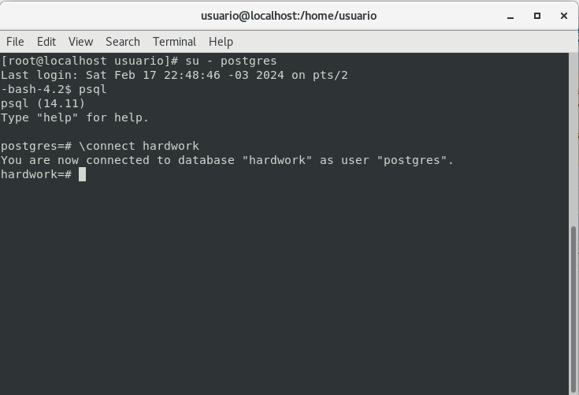

  Agora conectado ao banco de dados hardwork como usuário postgres

  ```sql
  UPDATE rh.departments SET department_name = 'I.T.' WHERE department_id = 1001;
  ```

  Veremos, então, se existe alguma transação P2C em execução:

  ```sql
  SELECT transaction, gid, owner, database, prepared, to_char(age(now(), prepared), 'HH24h:MIm:SSs') AS duracao_bloqueio FROM pg_prepared_xacts;
  ```

  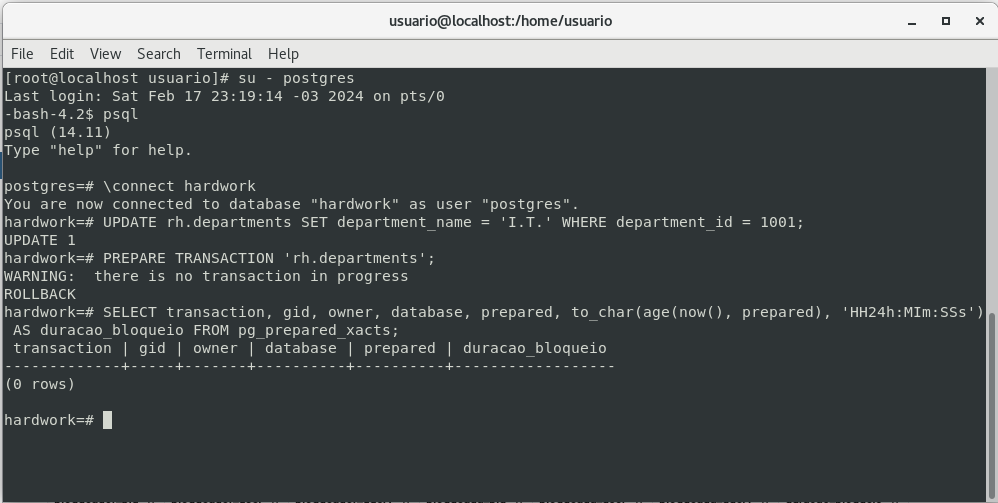

  Neste caso por se tratar de uma pequena alteração a consulta nao retornou registros.

  Porem caso retornasse algum registro, ao reiniciar o cluster esse registro ainda iria persistir

  ```bash
  \d
  ```

  ```bash
  systemctl restart postgresql-14  
  ```

  Para eliminar essa transação, é preciso executar um commit ou rollback, explicitamente com o comando:

  ```sql
  ROLLBACK PREPARED '<gid>';
  ```

  ```sql
  COMMIT PREPARED '<gid>';
  ```

  E em nova consulta seria validado eliminação.

<br/>

## **Monitorando tabelas e índices bloat**

Devido ao ***Multiversion Concurrency Control (MVCC)***, uma tabela poderá conter muitas versões antigas de linhas caso tais versões não possam ser removidas em tempo hábil. É possível que, mesmo depois que as versões antigas das tuplas sejam excluídas, a tabela permaneça com o tamanho grande recentemente adquirido, graças às linhas das versões obtidas.

### **Exemplo para validar tamanho da tabela**

```sql
SELECT pg_relation_size(relid) AS tablesize, schemaname, relname, n_live_tup FROM pg_stat_user_tables WHERE relname = <tablename>;
```

Os índices do tipo ***B-tree*** podem deixar grandes quantidades de folhas vazias em exclusões, onde são chamados de ***bloat***(inchados).

Umas das maneiras de monitorar o quão inchado o índice está é observando o tamanho deste em relação ao da tabela.

```sql
SELECT
  nspname,
  relname,
  round(100*pg_relation_size(indexrelid)/pg_relation_size(indrelid))/100 AS index_ratio,
	pg_size_pretty(pg_relation_size(indexrelid)) AS index_size,
  pg_size_pretty(pg_relation_size(indrelid)) AS table_size
FROM pg_index I
LEFT JOIN pg_class C ON (C.oid = I.indexrelid)
LEFT JOIN pg_namespace N ON (N.oid = C.relnamespace)
  WHERE nspname NOT IN ('pg_catalog', 'information_schema', 'pg_toast') AND C.relkind = 'i'
  AND pg_relation_size(indrelid) > 0
  ORDER BY index_ratio;
```

<br/>

## **Medição da eficiência do índice em relação**

A melhor forma de realmente entender como os índices funcionam é salvando o número de leituras de disco, mostrando quantos blocos foram de fato usados para satisfazer essa consulta. A ***view*** a seguir combina as duas fontes principais para estatísticas de tabelas relevantes, ***pg_stat_user_tables*** e ***pg_statio_user_tables***:

```sql
CREATE OR REPLACE VIEW table_stats AS
SELECT 
  stat.relname AS relname,
  seq_scan,
  seq_tup_read,
  idx_scan
FROM pg_stat_user_tables stat
RIGHT JOIN pg_statio_user_tables statio ON stat.relid = statio.relid;
```

<br/>

## **Monitorando o desempenho em tempo real com *PG_STAT_STATEMENTS***

Análise em tempo real das consultas. Esta adiciona a capacidade de rastreamento de estatísticas de execução de consultas efetuadas em um banco de dados, incluindo número de chamadas, tempo total de execução, número total de linhas retornadas, bem como informações internas sobre memória e acesso de ***I/O***.

O módulo ***pg_stat_statments*** está disponível no módulo ***contrib*** do PostgreSQL. A extensão deve ser instalada como superusuário nas bases de dados desejadas. Ela instalará o conjunto de views ***pg_stat_statements*** e a função ***pg_stat_statements_reset()***.

- **Instalação da EXTENSION, módulo pg_stat_statements:**

  ```sql
  CREATE EXTENSION pg_stat_statements;
  ```
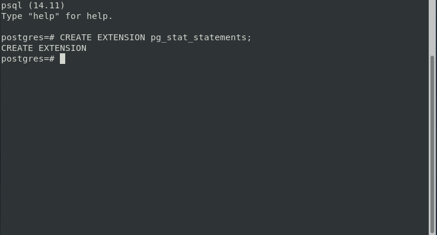

### **Após instalação da *extension* realizar as seguintes configurações no *postgresql.conf***

**Obs:** Neste caso foi realizada configuração utilizando a ***ALTER SYSTEM***

- ```
  shared_preload_libraries = ‘pg_stat_statements'
  ```

  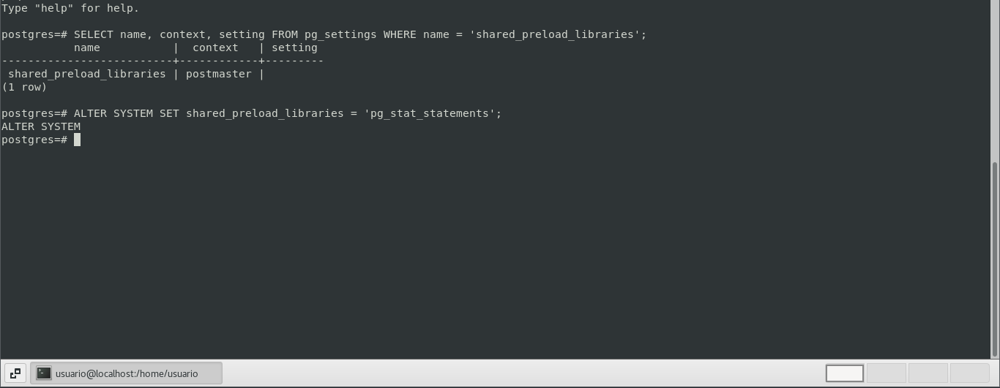

- ```
  pg_stat_statements.max = 10000
  ```

  ```
  pg_stat_statements.track = all
  ```

  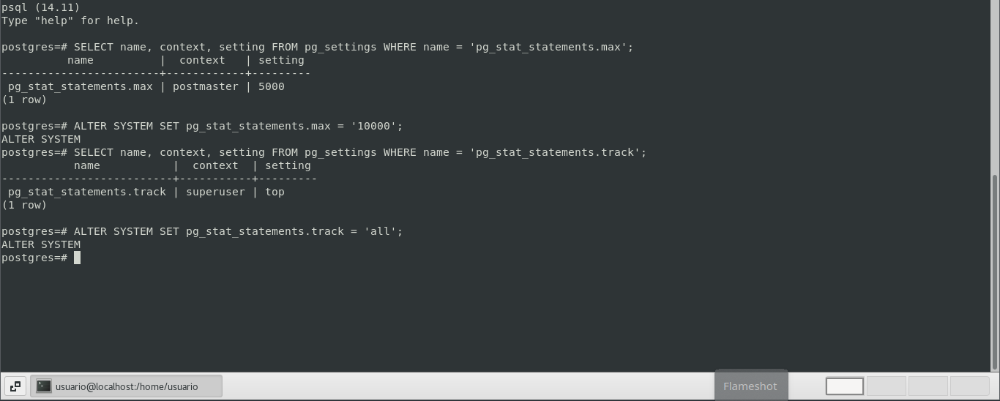

Após conclusão realizar o restart do cluster e já é possível verificar as queries com tempo de execução mais alto e o número de vezes em que foram executadas desde que o cluster está no modo ativo:

```sql
SELECT query, total_exec_time/calls AS avg, calls FROM pg_stat_statements ORDER BY 2 DESC;
```

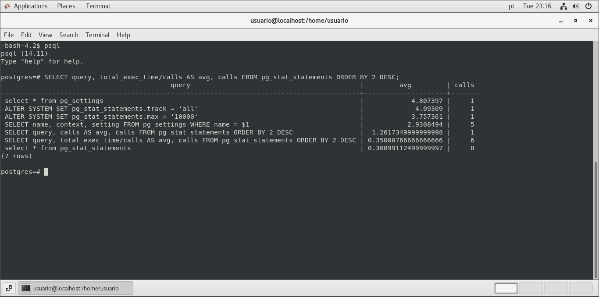


<br/>

[**<<==**](../capitulo_6/capitulo_6.md) |====| [**Home**](../README.md) |====| [**==>>**](../capitulo_8/capitulo_8.md)