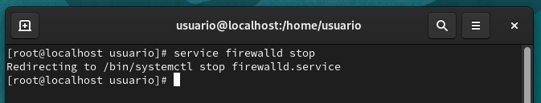
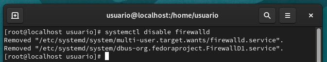
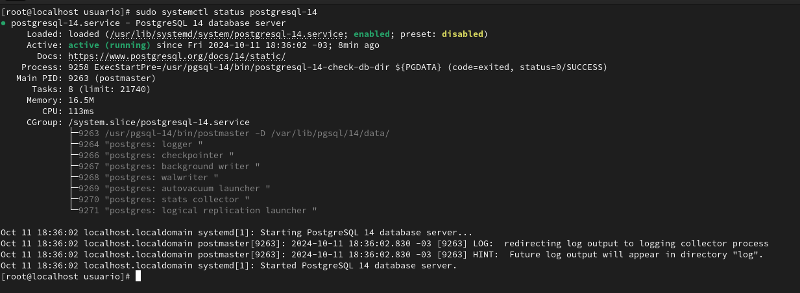
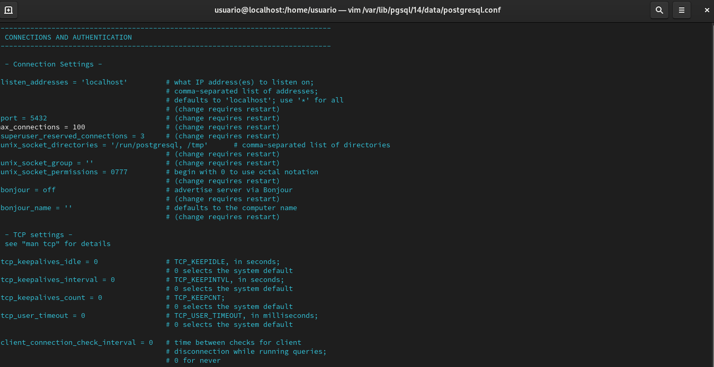
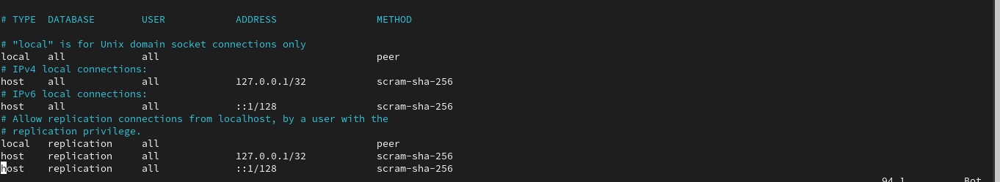

# **Instalação e orientações sobre suporte e versões**

## **Instalação do Oracle Linux**

[**Download Oracle Linux**](https://yum.oracle.com/oracle-linux-isos.html)

### **Atualizar o sistema**

Executar o seguinte comando no terminal como root:

```bash
dnf update
```

```bash
dnf upgrade
```

### **Configurar timezone (apenas por segurança)**

```bash
timedatectl set-timezone America/Sao_Paulo
```

### **Desabilitando *firewall* e o *Selix* (conjunto de restrições de segurança extra em cima das ferramentas de segurança normais do linux) em ambiente de teste**

- ### **Com o usuario `root` pare o serviço firewall**

	```bash
	su
	```

	```bash
	service firewalld stop
	```

	

- **Em seguida desbilite o mesmo**

	

	```bash
	systemctl disable firewalld
	```

- **Alterando arquivo de configuração**

	```bash
	vim /etc/sysconfig/selinux
	# SELINUX=disable
	```

</br>

---

</br>

## **Instalação do cluster PostgreSQL**

Seguir passo a passo conforme descrito em documentação oficial

- [**PostgreSQL Downloads**](https://www.postgresql.org/download/ "Packages and Installers")

## **Seguindo a documentação temos os seguintes passos:**

1. **Instale o repositório do PostgreSQL**

	```bash
	sudo dnf install -y https://download.postgresql.org/pub/repos/yum/reporpms/EL-9-x86_64/pgdg-redhat-repo-latest.noarch.rpm
	```

2. **Desabilite o modulo padrão do PostgreSQL**

	```bash
	sudo dnf -qy module disable postgresql
	```

3. **Instale o PostgreSQL e o pacote contrib**

	```bash
	sudo dnf install -y postgresql14-server postgresql14-contrib
	```

4. **Inicie o banco de dados**

	```bash
	sudo /usr/pgsql-14/bin/postgresql-14-setup initdb
	```

5. **Habilite a inicialização automática no boot**

	```bash
	sudo systemctl enable postgresql-14
	```

6. **Inicie o serviço do PostgreSQL**

	```bash
	sudo systemctl start postgresql-14
	```

7. **Para validar se o PostgreSQL esta em execução basta executar o seguinte comando:**

	```bash
	sudo systemctl status postgresql-14
	```

    

</br>

---
</br>

## **Configurações iniciais**

Apos instalação e possivel observar as configuracoes nos arquivos **postgresql.conf** e **pg_hba.conf** estando ajustados inicialmente apenas para conexões locais. 

No postgresql.conf caso necessario e possivel alterar isso modificando o parâmetro **listen_addresses**:


- **Acessando arquivo *postgresql.conf***

	```bash
	var/lib/pgsql/14/data/postgresql.conf
	```

	**Configuração padrão**

	

- **Acessando arquivo *pg_hba.conf***

	```bash
	vim /var/lib/pgsql/14/data/pg_hba.conf
	```

	**Configuração padrão**	

	

- Realizado a alteracao no `postgresql.conf` do campo `listen_addresses` para `'*'`.

- Realizado tambem a adicao no `pg_hba.conf` da seguinte liberacao

	```bash
	host    all             all             samenet                scram-sha-256
	```

  Com isso, depois do processo de ***reload*** do cluster, e possível conectar-se ao database desde que voce esteja na mesma rede com o usuario e com o usuario `postgres`.

- **Definindo senha do user postgres** <br/>
  Inserindo senha ao user postgres por meio o utilitário ***psql***, que é instalado juntamente com o **PostgreSQL**.

	Utilizando o utilitario `psql` atraves do usuario `postgres` para alteracao de senha

	```bash
	sudo -i -u postgres psql
	```

	```sql
	ALTER USER postgres WITH ENCRYPTED PASSWORD '<password>';
	```

<br/>

---

<br/>

 [**Home**](../../README.md) |====| [**==>>**](../capitulo_2/capitulo_2.md)

<br/>
