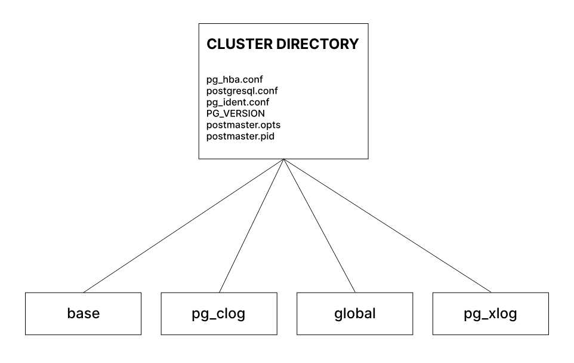
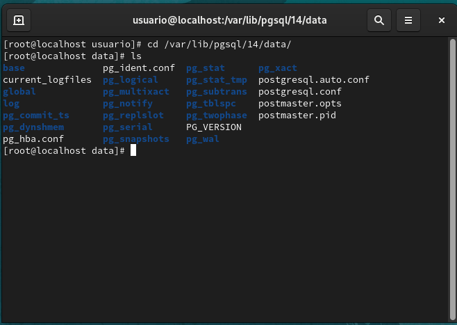
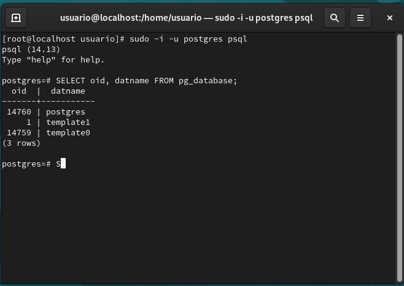
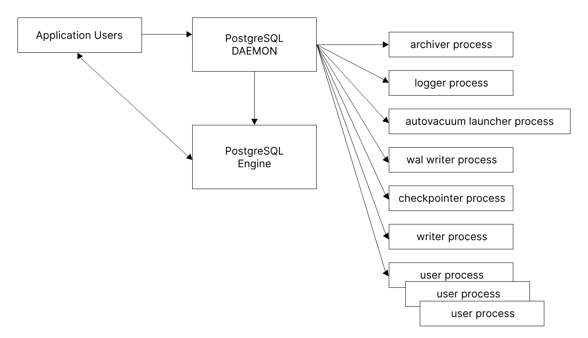
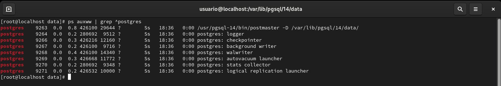
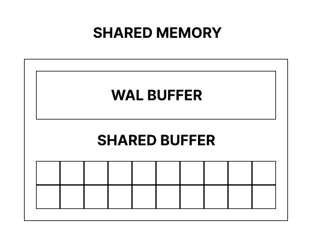

# **Estruturas do PostgreSQL**

## **Estrutura física do PostgreSQL9.4**

Na figura abaixo, visualizamos a estrutura básica do servidor **PostgreSQL** versão **9.4** (versao utilizada pelo autor do livro). 



Posteriormente foi alterada a denominação da localização **pg_xlog** para **pg_wal** além de outras mudanças até chegarmos a **versão 14 utilizada para acompanhamento do livro**.

### **No nível mais alto da hierarquia do PostgreSQL, temos os arquivos de configuração, sendo eles:**

- **pg_hba.conf**
  Arquivo de configuração para autenticação de usuários. Podemos entender o seu funcionamento como um arquivo ***ACL***. Relaciona **os usuários as bases de dados**, tipo de **autenticação e máscara de rede**.

- **pg_ident.conf**
  Usado pelo esquema de autenticação ***ident*** de usuários do **sistema operacional** com **PostgreSQL**, mapeia **usuários** de **sistema** e de **base de dados**, estando por padrão vazio.

- **postgresql.conf**
   Principal arquivo de configuração do PostgreSQL. Sua lista de parâmetros controlam os aspectos de funcionamento do ***cluster***. 

### **Estrutura do diretório *data* no PostgreSQL14 em uma instalação Oracle Linux 9.4:**



### **Breve descrição das principais localizações e arquivos:**

- **PG_VERSION** </br>
  Contém a versão majoritária do PostgreSQL.

- **base** </br>
  Armazena por padrão, os arquivos de dados em subdiretórios para cada base. O nome dos subdiretórios referentes às bases de dados do cluster podem ser obtidos consultando a tabela do catálogo **pg_database**:

	```sql
	SELECT oid, datname FROM pg_database;
	```

  

- **global** </br>
  Contém arquivos com dados dos catálogos (pg_database, pg_class...) e são visíveis globalmente, de todas as bases.

- **current_logfiles** </br>
  Arquivo que grava os arquivos de log atualmente gravados pelo colector de log (literalmente isso mesmo, é como um registro de localização do arquivo de log).

- **log** </br>
  Diretório com arquivos de log do PostgreSQL, cada um correspondendo a um dia da semana.

- **pg_commit_ts** </br>
  Subdiretório contendo dados de carimbo de data/hora de confirmação de transação.

- **pg_multixact** </br>
  Subdiretório, conteúdo volátil. Dados relacionados ao estado transacional da base de dados são encontrados aqui.

- **pg_stat** </br>
  Subdiretório, contendo arquivos permanentes para o subsistema de estatísticas.

- **pg_stat_tmp** </br>
  Subdiretório, contendo arquivos temporários para o subsistema de estatísticas.

- **pg_subtrans** </br>
  Subdiretório que contém dados de status de subtransação.

- **pg_tblspc** </br>
  Subdiretório que contem os **links simbólicos** para as tablespaces.

- **pg_twophase** </br>
  Subdiretório que contem os estados para transações do tipo **prepared transactions**.

- **pg_xlog (a partir da versão 10 chamado de *pg_wal* )** </br>
  Subdiretório que contem os arquivos de ***wal*** (Write Ahead Log).

- **postmaster.opts** </br>
  Arquivo utilizado para gravar as opções de linha de comando em que o servidor foi iniciado pela ultima vez.

- **postmaster.pid** </br>
  Arquivo que armazena as informações ***PID*** (postmaster process ID) atual caminho do diretório de dados do cluster, carimbo de data/hora de inicio do postmaster, número da porta, caminho do diretório de soquete do domínio Unix, first listen_address válido e ID de segmento de memória compartilhada. **OBS: Esse arquivo não esta presente após encerramento do servidor**.

- **postgresql.conf** </br>
  Principal arquivo de configuração do cluster.

- **postgresql.auto.conf** </br>
  Usado para armazenar parâmetros de configuração, configurados através do **ALTER SYSTEM**.

- **pg_hba.conf** </br>
  Arquivo que configura a conexão entre databases e clientes.

- **pg_ident.conf** </br>
  Arquivo que relaciona os usuários às bases de dados, por padrão vazio.

<br/>

---

<br/>

## **Estrutura de processos do PostgreSQL9.4 (versao utilizada pelo autor do livro)**



### **E possível observar esses processos com o comando *ps***

**Exemplo no PostgreSQL 14**

```bash
ps auxww | grep ^postgres
```



- **Logger Process**
  Coleta as informações do servidor para gravação em arquivo de logs, sendo também responsável por apagar os registros. Configurável em **postgresql.conf**. As informações podem ser tanto sobre o funcionamento normal do servidor inicio/parada, checkpoint, acessos etc, quanto sobre erros, no servidor ou no acesso a ele, incluindo instruções SQL.

- **Checkpointer Process**
  Executa, no PostgreSQL, os pontos de verificação, sinalizando que os dados no **WAL** devem ser descarregados e salvos no armazenamento persistente.

- **Background Writer Process**
  Responsável por garantir que os dados modificados em memória (no cache chamado "shared buffers") sejam periodicamente gravados no armazenamento físico.

- **Wal Writer Process**
  Também conhecido como **Write-Ahead Loggin Writer**, é responsável por gravar os registros de log de transações no arquivo de log de transações gravável (WAL).

- **Autovacuum Launcher Process**
  Dispara execuções de processo autovacuum worker quando configurado. Deve existir apenas um processo com este nome por cluster, podendo também inexistir, dependendo da configuração.

- **Stats Collector Process**
  Processo responsável por coletar informações estatísticas sobre o uso do banco de dados e suas atividades.

- **Logical Replication Launcher**
  É um processo no PostgreSQL responsável por iniciar e monitorar os processos de replicação lógica no servidor, onde replicação lógica é uma técnica que envia alterações de dados de uma origem para um destino usando uma representação lógica dos dados (como registros inseridos, atualizados ou excluídos), em vez de simplesmente copiar os blocos de dados brutos (como na replicação física).

<br/>

---

<br/>

## **Estrutura de memória do PostgreSQL**

As estruturas de memória do PostgreSQL estão na ***shared memory*** (memória compartilhada) do sistema operacional.

Nessa estrutura, um processo deve solicitar explicitamente uma área de memória, usando uma chave, para ser compartilhada por outros processos. Esse processo será chamado de servidor. Todos os demais processos, os clientes, que conhecem a área compartilhada, podem acessá-la. Assim, não há proteção para uma memória compartilhada, fazendo com que qualquer processo que tenha a chave possa acessá-la livremente.

A área da ***SHARED MEMORY*** utilizada pelo PostgreSQL divide-se em duas estruturas, ***WAL BUFFER*** e ***SHARED BUFFER***:



- **WALL BUFFER**
  Armazena temporariamente, antes de salvá-los em armazenamento persistente (como HD, SSD etc), os vetores de alterações realizadas sendo estes ***inserts***, ***updates***, ***deletes***.

- **SHARED BUFFER**
  Armazena os blocos de memória, minimizando o acesso ao armazenamento persistente e a contenção quando um grande número de usuários realizam acessos simultaneamente.
  
- **MVCC (Multversion Concurrency Control)**
    é o método utilizado pelo PostgreSQL para lidar com a consistência dos dados quando múltiplos processos acessam uma mesma tabela.
    
    No PostgreSQL, quando uma linha é atualizada, uma nova versão desta é criada e inserida na tabela. A versão anterior é fornecida como um ponteiro para a nova. Ela é marcada como **"expirada"**, mas permanece no banco de dados até que o **"coletor de lixo"** a elimine (processo de **VACUUM**). Para suportar a multiversão, cada tupla possui dois dados adicionais gravados em si.

    - **xmin**
      O ID da transação que inseriu/atualizou a linha e criou a tupla;

    - **xmax**
      A transação que excluiu a linha ou criou uma nova versão da tupla. Inicialmente este campo é nulo.

O status da transação é mantido em clog **$PGDATA/pg_clog** (**pg_commit_ts** psql na versao 14). Essa tabela contém dois bits de informações de status para cada transação. Os possíveis estados são: **em andamento**, **sofreram commit** ou **abortado**.

O PostgreSQL não desfaz as alterações nas linhas do database quando uma transação é abortada, simplesmente a marca como tal no **clog**. Portanto uma tabela no PostgreSQL pode conter dados de transações abortadas.

**Um processo de *VACUUM* é fornecido para eliminar os conteúdos das versões expiradas/abortadas de uma linha.**

<br/>

---

<br/>

[**<<==**](../capitulo_1/capitulo_1.md) |====| [**Home**](../../README.md) |====| [**==>>**](../capitulo_3/capitulo_3.md)

<br/>
