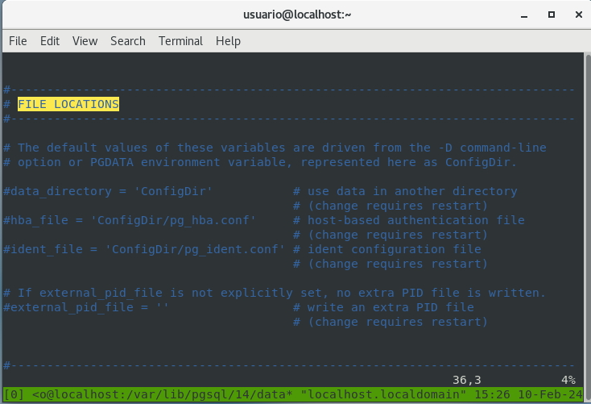
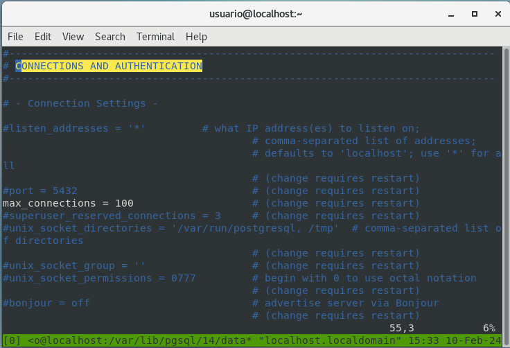
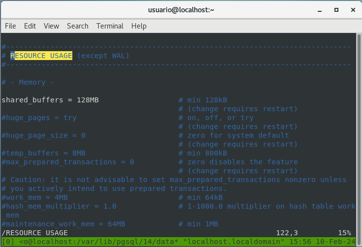
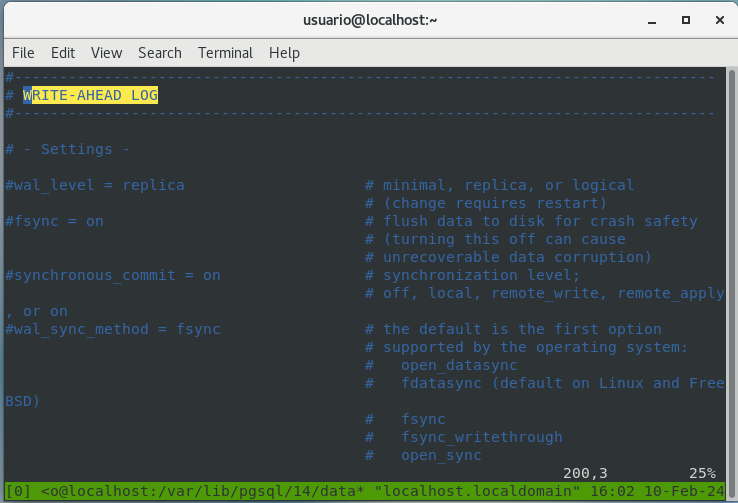
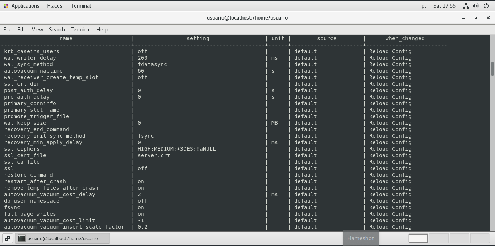
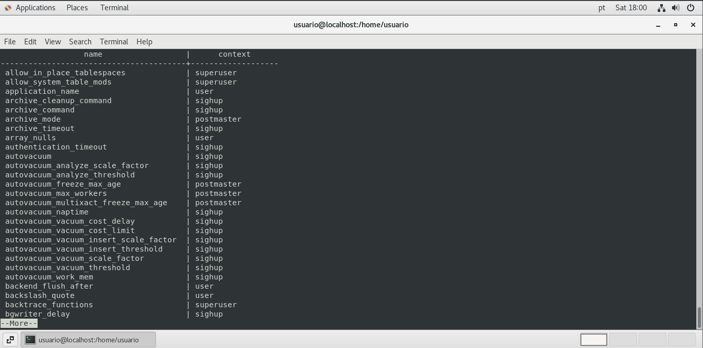
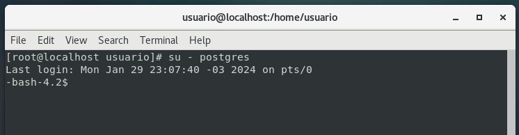

# **Arquivos de configuração**

<br/>

## **postgresql.conf**<br/>
O **postgresql.conf** e o principal arquivo de configuração do PostgreSQL, normalmente localizado em **$PGDATA**. Esse arquivo prescreve o comportamento para o cluster inteiro, ou seja, não é possível configurar comportamentos diferentes em relação a cada banco de dados. É necessário ter em mente que a partir da versão **9.4** foi adicionado o **ALTER SYSTEM**, que permite alterar os valores de parâmetros sem modificar o **postgresql.conf**. Por isso é **recomendado a verificação dos valores do parâmetro do PostgreSQL seja sempre realizada pela view pg_settings**. Os parâmetros ali encontrados dividem-se em várias seções no arquivo:

<br/>

## **Seções do arquivo *postgresql.conf* (PostgreSQL14)**

- CONNECTIONS AND AUTHENTICATION
- FILE LOCATIONS
- RESOURCE USAGE (except WAL)
- WRITE AHEAD LOG
- REPLICATIO
- QUERY TUNING
- ERROR REPORTING AND LOGGGING
- PROCESS TITLE
- RUNTIME STATISTICS
- AUTOVACUUM PARAMETERS
- CLIENT CONNECTION DEFAULTS
- LOCK MANAGEMENT
- VERSION/PLATAFORM COMPATIBILITY
- ERROR HANDLING
- CONFIG FILE INCLUDES
- CUSTOMIZED OPTIONS

### **Das seções apresentadas temos algumas a serem observadas**

- **FILE LOCATIONS**<br/>
  Seção onde são definidos localização e nomes de arquivos, como **hba_file**, **ident_file**, **data_directory** entre outros.
  
  

- **CONNECTIONS AND AUTHENTICATION**<br/>
  Seção que define as possibilidades de conexão e autenticação, como porta, protocolo entre outros.
  
  

- **RESOURSE USAGE**<br/>
  Seção que define a utilização de recursos pelo database **memória**, **disco** entre outros.
  
  

- **WRITE-AHEAD LOG**<br/>
  Seção que define as possibilidades de ajuste do ***WAL***.
  
  

### **Analisando alguns parâmetros do postgresql.conf**

- **max_connection**<br/>
  Número máximo de conexões suportadas pelo cluster. O valor iniicial de max_connection é **100**.

- **work_mem**<br/>
  O work_men é o espaço utilizado para operações de **bitmap**, **hash**, **join** e **merge**.

- **maintenance_work**<br/>
  Esse parâmetro define o espaço usado pelo **VACUUM** e **CREATE INDEX**. O valor default é 64MB.

- **seq_page_cost**<br/>
  Custo estimado de leitura de página em disco para páginas sequenciais, valor default 1.

- **random_page_cost**<br/>
  Custo estimado de leitura de página em disco para páginas não sequenciais, default 4 (quanto mais rápido o disco, ou o uso de SSD, menor pode ser o valor).

<br/>

## **Alterando os valores dos parâmetros do cluster PostgreSQL**

**Script para saber quais parâmetros necessitam restart para serem alterados.**

A **view** **pg_settings** fornece acesso aos parâmetros de tempo de execução do servidor.

```sql
SELECT 
  name,
  setting,
  unit,
  source,
  CASE context
    WHEN 'postmaster' THEN 'REQUIRES RESTART'
    WHEN 'sighup' THEN 'Reload Config'
    WHEN 'backend' THEN 'Reload Config'
    WHEN 'superuser' THEN 'Reload Config/Superuser'
    WHEN 'user' THEN 'Reload Config/User SET'
  END AS when_changed
FROM pg_settings
  WHERE context != 'internal'
  ORDER BY when_changed;
```



O **contexto** de cada variável informa-nos da necessidade ou não de reinicialização, abaixo comando alternativo:

```sql
SELECT name, context FROM pg_settings;
```



### **Os resultados obtidos na coluna *context* podem ser resumidos em:**

- **INTERNAL**<br/>
  Configurações realizadas em tempo de compilação, não podendo ser alteradas sem a recompilação do servidor.

- **POSTMASTER**<br/>
  É atualizado somente quando um reinício completo do servidor é realizado. Todas as configurações de memória enquadram-se nessa categoria.

- **SIGHUP**<br/>
  Enviar ao servidor um sinal HUP fará com que ele recarregue o **postgresql.conf**, e quaisquer alterações feitas neste parâmetro serão imediatamente ativadas.

- **BACKEND**<br/>
  Semelhantes ao SIGHUP, executando-se pelo fato de que as alterações feitas não afetarão nenhuma sessão de back-end de database já executada, apenas novas sessões iniciadas depois disso sofrerão alterações. Ex: **log_connections** não pode ser retroativo, para registrar uma conexão ja feita. Somente novas conexões, feitas depois que a **log_connections** estiver ativa, serão registradas.

- **SUPERUSER**<br/>
  Pode ser executado por qualquer superusuário do banco de dados (em geral, o usuário que criou o banco de dados - normalmente, o *postgres* ) a qualquer momento sem se quer exigir uma carga de configuração completa.

- **USER**<br/>
  As sessões de usuários podem ajustar esses parâmetros a qualquer momento. Suas mudanças afetarão apenas essa sessão.

A partir da versão 9.4, foi introduzido o comando **ALTER SYSTEM**, que permite alterar parâmetros sem editar o **postgresql.conf**. Quando utilizamos esse comando no mesmo diretório em que se situa o arquivo **postgresql.conf** válido do cluster, é criado o arquivo **postgresql.auto.conf**, que não deve ser editado diretamente e tem a primazia de seu conteúdo em relação ao **postgresql.conf**, mais um motivo para evitar a verificação dos parâmetros do cluster pela leitura do **postgresql.conf** e utilizar a view **pg_settings**. 

Caso seja necessária a localização dos arquivos, podemos utilizar a seguinte consulta:

```sql
SELECT name, setting FROM pg_settings WHERE category = 'File Locations';
```


<br/>

## **pg_hba.conf**

A autenticação no **cluster** é controlada por um arquivo de configuração chamado **pg_hba.conf**, armazenado no diretório de dados do cluster **$PGDATA** (HBA - host-based autentication (autenticação baseada em host)). Um arquivo **pg_hba.conf** padrão é instalado quando o diretório de dados é inicializado pelo **initdb**.

<br/>

|Local|Database|User|Aut-metod|[auth-options]|-|
|:-----:|:--------:|:----:|:---------:|:--------------:|:-:|
|Host|Database|User|Address|Aut-method|[auth-method]|
|Hostssl|Database|User|Address|Aut-method|[auth-method]|
|Hostnossl|Database|User|Address|Aut-method|[auth-options]|
|Host|Database|User|IP-address|IPmask Aut-method|Aut-method [auth-options]
|Hostssl|Database|User|IP-address|IPmask / Aut-method|Aut-method / [auth-options]
|Hostnossl|Database|User|IP-address|IPmask / Aut-method|Aut-method / [auth-options]

<br/>

- **Local**<br/>
  Conexão usando sequetes de domínio **Unix**. Sem um registro de tipo, as conexões de soquete de domínio não são permitidas. Quando não é inserida a opção **-h**, o **PSQL** tenta conectar-se por esse método.

- **Host**<br/> 
  Conexão usando **TCP/IP**. Os registros do host combinam tentativas de conexão **SSL** ou não **SSL**. Conexões remotas serão possíveis somente se o servidor for iniciado com o valor apropriado de **listen_addresses**, **postgresql.conf**, cujo valor padrão é **localhost**.

- **Hostssl**<br/> 
  Conexão usando **TCP/IP**, mas somente quando efetuada com criptografia **SSL**. Para fazer uso dessa opção, o servidor deve ser construído com suporte **SSL**. Além disso, o **SSL** deve ser ativado no início do servidor, definindo o parâmetro de configuração **SSL**.

- **Hostnossl**<br/>
  Conexão usando **TCP/IP**, mas com comportamento oposto ao de **hostssl**. Apenas combina tentativas de conexão feitas através de **TCP/IP** que não usam **SSL**.

- **Database**<br/>
  Especifica quais databases o registro correspondente pode acessar. O valor **all** determina que qualquer database pode ser acessado. Multiplos nomes podem ser fornecidos separados por vírgula, pode ser criado tambem um arquivo separado com nomes dos databases onde o arquivo pode ser especificado antes do nome do arquivo com um **@**.

- **User**<br/>
  Especifica quais nomes de usuário de database esse registro corresponde. O valor **all** refere-se a todos os usuários.

- **Address**<br/>
  Especifica o(s) endereço(s) da máquina do cliente a quem este registro corresponde. Esse campo pode conter um nome de **host**, um intervalo de endereço **IP** ou uma das palavras-chave especiais.

- **IP-adress e IP-mask**<br/>
  Estes dois campos podem ser usados como uma alternativa à notação de endereço IP/máscara. Em vez de indicar o comprimento da máscara, a máscara real é especificada em uma coluna separada.

### **Estes campos aplicam-se somente aos registros host, hostssl e hostnossl:**

- **Auth-method**<br/>
  Especifica o **método** de **autenticação** a ser usado quando uma conexão corresponde a este registro.

- **Trust**<br/>
  Este método **permite conexões incondicionalmente**. Possibilita que qualquer pessoa conecte-se ao servidor SGBD PostgreSQL para entrar como qualquer usuário do PostgreSQL que deseje, sem a necessidade de uma senha ou outra autenticação.

- **Reject**<br/> 
  **Rejeita a conexão incondicionalmente**. Isso é útil para **“filtrar” determinados hosts de um grupo**; por exemplo uma linha de rejeição para bloquear um host específico, enquanto uma linha posterior permite que os hosts restantes de uma rede específica conectem-se.

- **MD5**<br/> 
  Exige que o cliente forneça uma senha criptografada **MD5** para autenticação.

- **Password**<br/> 
  Exige que o cliente forneça uma senha não criptografada para autenticação.

- **Ident**<br/>
  Recupera o nome de usuário do sistema operacional cliente contatando o servidor ident no cliente e verificando se este corresponde ao nome de usuário do database solicitado. A autenticação de ident (identidade) pode ser usada **somente em conexões TCP/IP**.

- **Peer**<br/> 
  Recupera o nome de usuário do sistema operacional cliente e verifica se este corresponde ao nome de usuario do database solicitado.

- **LDAP**<br/> 
  Realia a autenticação recorrendo a um servidor LDAP (por exemplo Novell, Microsoft AD etc.).

- **Cert**<br/> 
  Realiza a autenticação usando certificados SSL do cliente.

- **PAM**<br/> Realiza a autenticação usando o
  serviço de Módulos de Autenticação Plug-in (PAM) fornecido pelo sistema operacional.
  
- **Auth-options**<br/>
  Depois do campo de método de autenticação, pode(m) haver campo(s) de nome do formulário = valor que especifica opções para o método de autenticação. **Dessa forma, pela combinação dos elementos citados anteriormente, esse arquivo descreve quem pode, de onde se pode e como se pode fazer a autenticação (MD5, LDPA etc)**.

**Para que as configurações surtam efeito - sejam carregadas no cluster, é necessário forçar o cluster a ler novamente os arquivos postgresql.conf e pg_hba.conf, com o seguinte comando no Linux, Red Hat, CentOS o Oracle, versão 7:**

```bash
systemctl reload postgresql-9.4
```

Depois de configurado, precisamos realizar a conexão ao cluster, o usuário inicial é o **postgres**, o **owner** do cluster. O usuário postgres é gerado por dafault na criação do cluster, podendo ser realizado o primeiro acesso dessa forma:

```bash
su - postgres
```



<br/>

[**<<==**](../capitulo_2/capitulo_2.md) |====| [**Home**](../../README.md) |====| [**==>>**](../capitulo_4/capitulo_4.md)

<br/>