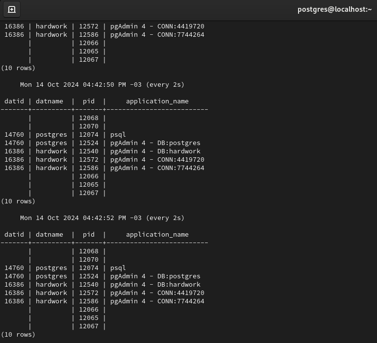

# Volumetria e disponibilidade

Ao abordar monitoramento no PostgreSQL geralmente são referidos dois tipos que são eles **continuo** e **pontual**.

- **`uptime`** <br/>
  Tempo em que a base de dados esta disponível, o mesmo pode ser obtido através do log (local definido em `log_directory` no arquivo postgresql.conf) ou através da função `pg_postmaster_start_time()` que retorna, o momento data e hora do start da base de dados:

	```sql
	SELECT date_trunc('hour', pg_postmaster_start_time()) as start_date, date_trunc('second', current_timestamp - pg_postmaster_start_time()) as uptime;
	```

	

- **Variação do tamanho da base**
	O tamanho da base de dados pode ser analisado com a seguinte consulta:

	```sql
	SELECT pg_size_pretty(sum(pg_database_size(oid))::BIGINT) FROM pg_database;
	```

	
	
- **Numero total de conexões**
  Para verificar o quão próximo o numero de conexões esta de atingir o limite:
  
	```sql
	SELECT count(*) as total_conn FROM pg_stat_activity;
	```

	

- **Monitoramento de usuários/sessões do cluster**
	Com `pg_stat_activity`, podemos monitorar as conexões ao cluster.

	```sql
	SELECT datid, datname, pid, application_name FROM pg_stat_activity;
	```

	E possível repetir o `select` com `\watch x;` sendo `x` o numero de segundos entre os intervalos de consulta.

	

	

<br/>

---

<br/>

## Eliminação de seções no cluster

Por diversos motivos (execução de comandos muito demorados, locks em outras sessões etc...), podemos ter a necessidade de eliminar uma sessão. Uma boa pratica e cancelar o comando SQL antes de tal eliminação. Isso pode ser realizado com a função `pg_cancel_backend(pid);` caso não seja possível, utilizamos a função `pg_terminate_backend(pid)`, como no exemplo a seguir:

```sql
SELECT datid, datname, pid, application_name FROM pg_stat_activity;
```


Encerrando as conexões com pid 12540 e 12572 e 12586 correspondente as operações que estavam sendo realizadas com pgAdmin4 na base `hardwork`:

```sql
SELECT pg_terminate_backend(12540);
```

```sql
SELECT pg_terminate_backend(12572);
```

```sql
SELECT pg_terminate_backend(12586);
```

Apos encerramento ao tentar dar continuidade no pgAdmin4 o mesmo apresentou aviso relacionado a perca de conexão:


Em algumas situações, caso o procedimento falhe, e possível utilizar o comando citado anteriormente `KILL -9`: 

```bash
kill -9 3424
```

<br/>

---

<br/>

## Monitoramento de execução pontual de queries

Para realizar o monitoramento pontual dos comandos, queries, que estão sendo executados no cluster, e possível utilizar o seguinte comando:

```sql
SELECT datname, usename, pid, state, query FROM pg_stat_activity;
```

Como se trata de uma base que não esta em produção, apos executar a consulta citada acima, em seguida digitar o comando `\watch 2`, para que a mesma execute a cada 2 segundos:


### A query pode apresentar os seguintes states:

- `active`
	- O processo `back-end` esta executando uma **query**  - **"esta ativo"**.
- `idle`
	- O processo esta aguardando um novo comando de cliente - **"esta ocioso"**.
- `idle in transaction`
	- O processo esta em uma transação mas não esta executando uma **query**.
- `idle in transaction (aborted)`
	- Este estado e semelhante ao `idle in transaction` exceto quando uma das instruções na transação causou um erro.
- `fastpath function call`
	- O processo esta executando uma `fast-path function`.
- `disabled`
	- Este estado e relatado se as `track_activities` estiverem desabilitadas nesse processo.

<br/>

E possível utilizar-se dessas informações para filtrar por exemplo as queries que estão ativas:

```sql
SELECT datname, usename, query FROM pg_stat_activity WHERE state = 'active';
```


Caso queira mais especificamente filtrar as queries que apresentam mais demora/lentidão na execução, e possível executar a seguinte consulta:

```sql
SELECT 
  current_timestamp-query_start AS runtime,
  pid,
  query_start,
  datname,
  usename,
  query
FROM pg_stat_activity
WHERE state = 'active'
ORDER BY 1 DESC;
```


Ou mais especifico ainda, queries que estão demorando mais que um determinado tempo de execução:

```sql
SELECT 
  current_timestamp-query_start AS runtime,
  pid,
  query_start,
  datname,
  usename,
  query
FROM pg_stat_activity
WHERE state = 'active'
AND current_timestamp-query_start > '2min'
ORDER BY 1 DESC;
```


<br/>

---

<br/>

## Monitoramento de queries ativas ou bloqueadas

Uma query ativa a muito tempo pode estar esperando algum recurso ou bloqueada, aguardando um registro retido por outra sessão.

- **Abriremos uma sessão e rodaremos uma consulta que deve aguardar alguns minutos para executar:**

	```sql 
	SELECT pg_sleep(300);
	```

- **Agora verificaremos o que esta rodando e qual o seu state:**
	```sql
	SELECT current_timestamp-query_start AS runtime, pid, datname, usename, query, state FROM pg_stat_activity;
	```

E possível observar que a query esta aguardando o final do tempo, e seu estado e `active`:


<br/>

---

<br/>

## Monitoramento simultâneo de sessões bloqueadas e bloqueadoras

Uma causa de lentidão e problemas são bloqueios demorados, para saber informações como quem esta bloqueando e quem esta sendo bloqueado, duração e impacto e possível utilizar a seguinte consulta:

```sql
SELECT
  kl.pid AS bloqueador_pid,
  ka.usename AS bloqueador_user,
  ka.query AS bloqueador_query,
  bl.pid AS bloqueada_pid,
  a.usename AS bloqueada_user,
  a.query AS bloqueada_query,
  to_char(age(now(), a.query_start),'HH24h:MIm:SSs') AS duracao_bloqueio
FROM pg_catalog.pg_locks bl
JOIN pg_catalog.pg_stat_activity a ON bl.pid = a.pid
JOIN pg_catalog.pg_locks kl ON bl.locktype = kl.locktype
  AND bl.database IS NOT DISTINCT FROM kl.database
  AND bl.relation IS NOT DISTINCT FROM kl.relation
  AND bl.page IS NOT DISTINCT FROM kl.page
  AND bl.tuple IS NOT DISTINCT FROM kl.tuple
  AND bl.virtualxid IS NOT DISTINCT FROM kl.virtualxid
  AND bl.transactionid IS NOT DISTINCT FROM kl.transactionid
  AND bl.classid IS NOT DISTINCT FROM kl.classid
  AND bl.objid IS NOT DISTINCT FROM kl.objid
  AND bl.objsubid IS NOT DISTINCT FROM kl.objsubid
  AND bl.pid <> kl.pid
  JOIN pg_catalog.pg_stat_activity ka ON kl.pid = ka.pid
  WHERE kl.granted AND NOT bl.granted
  ORDER BY a.query_start;
```

Caso essa verificação torne-se comum e uma opção criar uma view:

```sql
CREATE VIEW view_bloqueios AS 
SELECT
  kl.pid AS bloqueador_pid,
  ka.usename AS bloqueador_user,
  ka.query AS bloqueador_query,
  bl.pid AS bloqueada_pid,
  a.usename AS bloqueada_user,
  a.query AS bloqueada_query,
  to_char(age(now(), a.query_start),'HH24h:MIm:SSs') AS duracao_bloqueio
FROM pg_catalog.pg_locks bl
JOIN pg_catalog.pg_stat_activity a ON bl.pid = a.pid
JOIN pg_catalog.pg_locks kl ON bl.locktype = kl.locktype
  AND bl.database IS NOT DISTINCT FROM kl.database
  AND bl.relation IS NOT DISTINCT FROM kl.relation
  AND bl.page IS NOT DISTINCT FROM kl.page
  AND bl.tuple IS NOT DISTINCT FROM kl.tuple
  AND bl.virtualxid IS NOT DISTINCT FROM kl.virtualxid
  AND bl.transactionid IS NOT DISTINCT FROM kl.transactionid
  AND bl.classid IS NOT DISTINCT FROM kl.classid
  AND bl.objid IS NOT DISTINCT FROM kl.objid
  AND bl.objsubid IS NOT DISTINCT FROM kl.objsubid
  AND bl.pid <> kl.pid
  JOIN pg_catalog.pg_stat_activity ka ON kl.pid = ka.pid
  WHERE kl.granted AND NOT bl.granted
  ORDER BY a.query_start;
```

Ao observar esses bloqueios, podemos ter um exemplo em que dezenas de sessões são bloqueadas por uma unica outra em que, ao eliminar a bloqueada primaria, conseguimos liberar automaticamente todas as demais da fila de bloqueios.

<br/>

---

<br/>

# Monitoramento de transações `two-phase commit` (2PC) 

Ao usar transações distribuídas, ou similares, podemos acabar em uma situação na qual temos um bloqueio persistente sem um processo especifico.

**Para ilustrar sera gerado um bloqueio do tipo mencionado:**

- **Conectando ao database `hardwork`**

	```bas
	su - postgres
	```

	```bash
	psql
	```

	```
	\connect hardwork
	```

	

	Agora conectado ao banco de dados `hardwork` como usuário postgres
	
	```sql
	UPDATE rh.departments SET department_name = 'I.T.' WHERE department_id = 1001;
	```

	Veremos, então, se existe alguma transação P2C em execução:

	```sql
	SELECT transaction, gid, owner, database, prepared, to_char(age(now(), prepared), 'HH24h:MIm:SSs') AS duracao_bloqueio FROM pg_prepared_xacts;
	```

	

	Neste caso por se tratar de uma pequena alteração a consulta não retornou registros.
	Porem caso retornasse algum registro, ao reiniciar o cluster esse registro ainda iria persistir.

	```sql
	\q
	```

	```bash
	systemctl restart postgresql-14
	```

	Para eliminar essa transação, e preciso executar um commit ou `rolback`, explicitamente com o comando:

	```sql
	ROLLBACK PREPARED '<gid>';
	```

	```sql
	COMMIT PREPARED '<gid>';
	```

<br/>

---

<br/>

# Monitorando tabelas e indices bloat

Devido ao **_Multiversion Concurrency Control (MVCC)_**, uma tabela poderá conter muitas versões antigas de linhas caso tais versões não possam ser removidas em tempo hábil. E possível que, mesmo depois que as versões antigas das tuplas sejam excluídas, a tabela permaneça com o tamanho grande recentemente adquirido, gracas as linhas das versões obtidas.

**Exemplo para validar o tamanho da tabela**

```sql
SELECT pg_relation_size(relid) AS tablesize, schemaname, relname, n_live_tup FROM pg_stat_user_tables WHERE relname = <tablename>;
```

Os indices do tipo **_B-tree_** podem deixar grandes quantidades de folhas vazias em exclusões, onde são chamados de **_bloat_** (inchados). Uma das maneiras de monitorar o quão inchado o índice esta e observando o tamanho em relação ao da tabela.

```sql
SELECT
  nspname,
  relname,
  round(100*pg_relation_size(indexrelid)/pg_relation_size(indrelid))/100 AS index_ratio,
	pg_size_pretty(pg_relation_size(indexrelid)) AS index_size,
  pg_size_pretty(pg_relation_size(indrelid)) AS table_size
FROM pg_index I
LEFT JOIN pg_class C ON (C.oid = I.indexrelid)
LEFT JOIN pg_namespace N ON (N.oid = C.relnamespace)
  WHERE nspname NOT IN ('pg_catalog', 'information_schema', 'pg_toast') AND C.relkind = 'i'
  AND pg_relation_size(indrelid) > 0
  ORDER BY index_ratio;
```

<br/>

---

<br/>

## Medição da eficiência do índice

A melhor forma de realmente entender como os indices funcionam e salvando o numero de leituras de disco, mostrando quantos blocos foram de fato usados para satisfazer essa consulta. A **_view_** a seguir combina as duas fontes principais para estatísticas de tabelas relevantes, `pg_stat_user_tables` e `pg_statio_user_tables`:

```sql
CREATE OR REPLACE VIEW table_stats AS
SELECT 
  stat.relname AS relname,
  seq_scan,
  seq_tup_read,
  idx_scan
FROM pg_stat_user_tables stat
RIGHT JOIN pg_statio_user_tables statio ON stat.relid = statio.relid;
```

<br/>

---

<br/>

# Monitorando o desempenho em tempo real com `pg_stat_statements`:

Analise em tempo real das consultas. Esta adiciona a capacidade de rastreamento de estatísticas de execução de consultas efetuadas em um banco de dados, incluindo numero de chamadas, tempo total de execução, numero total de linhas retornadas, bem como informações internas sobre memoria e acesso de `I/O`.

O modulo `pg_stat_statments` esta disponível no modulo `contrib` do PostgreSQL. A extensão deve ser instalada como superusuário nas bases de dados desejadas. Ela instalara o conjunto de views `pg_stat_statements_reset()`.
**Instalação da extension, modulo `pg_stat_statements`:**

```sql
CREATE EXTENSION pg_stat_statements;
```


Apos instalação da extension realizar as seguintes configurações no postgresql.conf

**OBS:** Neste caso foi realizada configuração utilizando a **_ALTER SYSTEM_**

```sql
ALTER SYSTEM SET shared_preload_libraries = 'pg_stat_statements';
```

**apos alteração reinicie o serviço**


```sql
ALTER SYSTEM SET pg_stat_statements.max = '10000';
```

```sql
ALTER SYSTEM SET pg_stat_statements.track = 'all';
```


Apos conclusão ao realizar o restart do cluster já e possível verificar as queries com tempo de execução mais alto e o numero de vezes em que foram executadas desde que o cluster esta no modo ativo:

```sql
SELECT query, total_exec_time/calls AS avg, calls FROM pg_stat_statements ORDER BY 2 DESC;
```


<br/>

---

<br/>

# Monitorando detalhadamente dados e indices de dados

### **Monitoramento de area**

Existem alguns módulos _**contrib**_ bastante úteis para monitorar espaço utilizado por índices e tabelas, como o **pgstattuple**, que disponibiliza informações relacionadas a utilização de tuplas e **pg_freespacemap**, fornecendo um meio para monitorar o **FSM** (_Free Space Map_ - mapa de espaço livre).

```sql
CREATE OR REPLACE VIEW av_needed AS 
SELECT *,
  n_dead_tup > av_threshold AS av_needed,
  CASE
    WHEN reltuples > 0 THEN round(100.0 * n_dead_tup/(reltuples))
  ELSE 0
  END AS pct_dead
FROM 
( SELECT
    N.nspname, C.relname,
    pg_stat_get_tuples_inserted(C.oid) AS n_tup_ins,
    pg_stat_get_tuples_updated(C.oid) AS n_tup_upd,
    pg_stat_get_tuples_deleted(C.oid) AS n_tup_del,
    CASE 
      WHEN pg_stat_get_tuples_updated(C.oid) > 0 THEN pg_stat_get_tuples_hot_updated(C.oid)::REAL/pg_stat_get_tuples_updated(C.oid)
    END AS hot_update_ratio,
    pg_stat_get_live_tuples(C.oid) AS n_live_tup,
    pg_stat_get_dead_tuples(C.oid) AS n_dead_tup,
    C.reltuples AS reltuples, ROUND(current_setting('autovacuum_vacuum_threshold')::INTEGER+current_setting('autovacuum_vacuum_scale_factor')::NUMERIC*C.reltuples) AS av_threshold,
    DATE_TRUNC('minute', GREATEST(pg_stat_get_last_vacuum_time(C.oid),
    pg_stat_get_last_autovacuum_time(C.oid))) AS last_vacuum,
    DATE_TRUNC('minute', GREATEST(pg_stat_get_last_analyze_time(C.oid), pg_stat_get_last_analyze_time(C.oid))) AS last_analyze
  FROM pg_class C
  LEFT JOIN pg_index I ON C.oid = I.indrelid
  LEFT JOIN pg_namespace N ON (N.oid = C.relnamespace)
    WHERE C.relkind IN ('r', 't')
    AND N.nspname NOT IN ('pg_catalog', 'information_schema') AND N.nspname !~ '^pg_toast') AS av
    ORDER BY av_needed DESC, n_dead_tup DESC;
```

O PostgreSQL suporta comandos para reconstrução de índices. O utilitário do cliente permite a execução do **`REINDEX`** pelo sistema operacional:

```bash
reindexdb
```

O comando acima irá executar o **SQL `REINDEX`** em cada tabela no banco de dados padrão, caso deseje reindexar todos os bancos de dados é possível usar o comando:

```bash
reindexdb -a
```

O **`REINDEX`** coloca um _**access exclusive lock**_ (bloqueio de tabela exclusiva) enquanto é executado, de modo que provavelmente o **database** ficará indisponível para uso.

<br/>

---

<br/>

## **Monitoramento de uso dos índices**

É possível monitorar os índice nos databases a partir de **views** de sistemas, que registram a utilização dos mesmos:

- **pg_stat_all_indexes:** Informações de todos os índices do **database**.
- **pg_stat_sys_indexes:** Informações de todos os índices das tabelas do sistema.
- **pg_stat_user_indexes:** Informações de todos os índices das tabelas dos usuários.


<br/>

---

<br/>

## **As principais informações apresentadas nas views são**

- **`Relid`:** Identificador da tabela referenciada.
- **`Indexrelid`:** Identificador do índice.
- **`Schemaname`:** Nome do schema onde estão as tabelas e os índices.
- **`Relname`:** Nome da tabela.
- **`Indexrelname`:** Nome do índice.
- **`idx_scan`:** Quantidade de utilizações do índice.
- **`idx_tup_read`:** Quantidade de linhas lidas do índice.
- **`idx_tup_fetch`:** Quantidade de linhas da tabela lidas pelo índice.

**É possível verificar o tamanho de cada índice nunca utilizado:**

```sql
SELECT 
  sai.schemaname AS esquema,
  sai.relname AS tabela,
  sai.indexrelname AS nome_indice,
  sai.schemaname||'.'||sai.indexrelname AS esq_indice,
  pg_size_pretty(pg_relation_size(sai.indexrelid::BIGINT)) AS tamanho
FROM pg_stat_all_indexes sai
INNER JOIN pg_index idx ON idx.indexrelid = sai.indexrelid
  WHERE sai.idx_scan = 0
  AND sai.schemaname NOT IN ('pg_toast','pg_catalog')
  AND idx.indisprimary = 'n'
  ORDER BY pg_relation_size(sai.indexrelid::BIGINT) DESC;
```

**Outra informação importante é a existência de índices duplicados. Onde é possível selecionar o índice mais amplo e apagar as demais duplicatas:**

```sql
SELECT 
  pg_stat_user_indexes.schemaname AS nome_do_esquema,pg_stat_user_indexes.relname AS nome_da_tabela,
  pg_attribute.attname AS nome_do_atributo,pg_stat_user_indexes.indexrelname AS nome_do_indice,pg_size_pretty(pg_relation_size(indexrelid::BIGINT)) AS tamanho,
  CASE pg_index.indisprimary
    WHEN 't' THEN 'Sim'
  ELSE 'Nao'
  END AS indice_na_chave_primaria
FROM pg_index
JOIN pg_stat_user_indexes USING(indexrelid)
JOIN (SELECT  
        pg_index.indrelid,
        pg_index.indkey,
        count(*)
      FROM pg_index
      JOIN pg_stat_user_indexes USING(indexrelid)
      GROUP BY pg_index.indrelid, pg_index.indkey
      HAVING count(*)>1) ind_dup ON pg_index.indrelid = ind_dup.indrelid AND pg_index.indkey = ind_dup.indkey
JOIN pg_attribute ON pg_attribute.attrelid = ind_dup.indrelid AND pg_attribute.attnum = SOME(pg_index.indkey)
  ORDER BY pg_stat_user_indexes.schemaname, tamanho DESC, pg_stat_user_indexes.relname, pg_index.indisprimary = 't' DESC;
```

<br/>

---

<br/>

## **Estatísticas**

Existem dois tipos básicos de estatísticas geradas no PostgreSQL **distribuição de dados** e **monitoramento**

As estatísticas de distribuição são utilizadas para fornecer informações que promovem um plano de execução para as **queries**. Algumas dessas informações são:

- Quantas linhas são retornadas em uma consulta de **join**.
- Quanta memória é necessária para realizar a agregação.

**É possível apagar as estatísticas com o uso de funções como:**

**Apagando em uma tabela:**

```sql
SELECT pg_stat_reset_single_table_counters(<oid of the table>);
```

**Apagando em todas as tabelas:**

```sql
SELECT pg_stat_reset();
```

Com base nessas informações é possível escolher melhor o plano de execução para efetuar uma consulta, diminuindo, com isso, a utilização de I/O de disco e o uso de CPU e memória. Essas informações são coletadas pelo **`ANALYZE`** ou **`AUTOVACUUM`** e armazenadas em tabelas regulares onde é possível acessar a `pg_statistic` ou uma visão `pg_stats`.

<br/>

---

<br/>

[**<<==**](../capitulo_6/capitulo_6.md) |====| [**Home**](../../README.md) |====| [**==>>**](../capitulo_8/capitulo_8.md)

<br/>