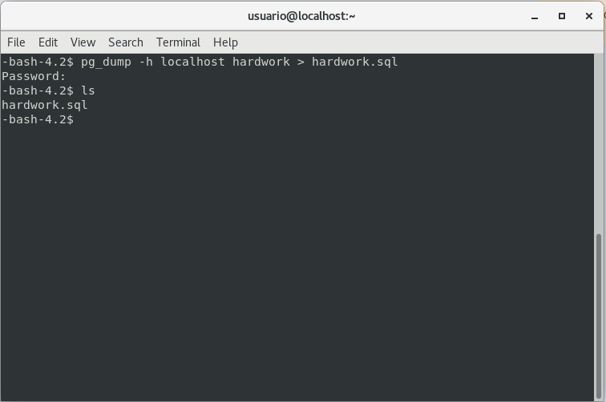
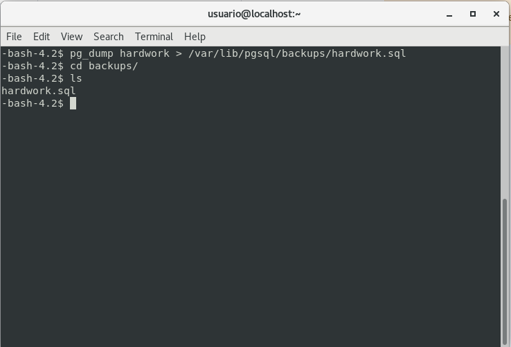
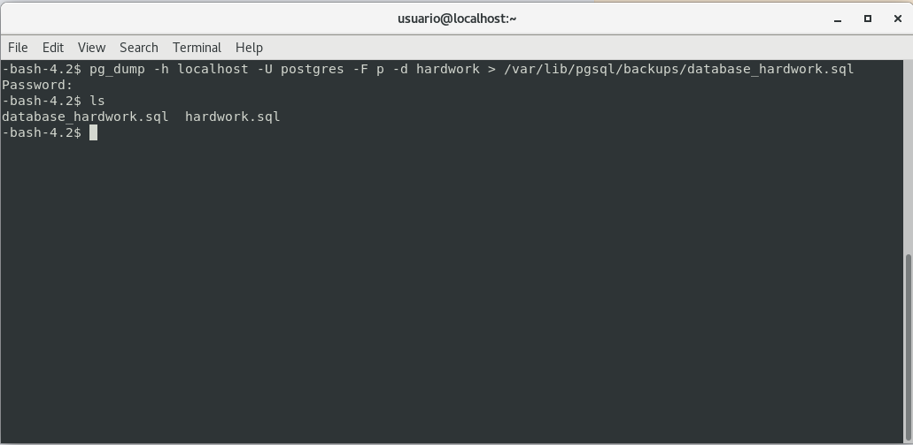

# **Executando backups e restaurações no cluster PostgreSQL**

<br/>

**Existem vários tipos de backups que podem ser aplicados ao cluster PostgreSQL, sendo que cada um cobre cenários diferentes:**

- **Cold backup**<br/>
  Backup físico em que o database é desligado antes da cópia de seus arquivos.

- **Hot backup**<br/>
  Backup realizado com o database em funcionamento. Pode apresentar problemas de consistência, mas não gera indisponibilidades ao sistema. É de dois tipos, físico e lógico:
    
    - **Backup físico**<br/>
      São copiados os arquivos do banco de seus diretorios de origem. Esse tipo de backup normalmente é realizado com o databaase desligado, mas pode ser implementado com ***hot backup*** com mecanismos de geração e gerenciamento de **WAL**. Esse tipo de backup não é utilizado ara migrações de versão. Permite a recuperação **PITR** e Total usando os arquivos de vetores transacionais.

    - **Backup lógico**<br/>
      Realizado com o banco aberto, em que são gerados arquivos com os comandos SQL para recriação do ambiente, independe de ambiente de hardware e pode ser usado para migração de dados. Permite a cópia de objetos individuais, são extraídos os dados e os metadados, gerando scripts que podem ser aplicados para restaurar um banco de dados a uma determinada posição.

- **Arquivos de carga**<br/>
  Backup onde são utilizadas ferramentas **ETL**, sendo gerados arquivos de dados e scripts de criação, armazenados como cópia de segurança ou para migração.

- **Backup dos arquivos de vetores de alteração**<br/>
  **Ao realizar o backup completo de um database, estamos realizando a cópia de uma posição no tempo. Um banco ativo, depois de algum tempo, terá uma quantidade enorme de registros alterados ou inseridos que, em caso de falha do servidor, poderão ser perdidos. Com base no exemplo apresentado pode ser necessário salvar os arquivos de *vetores de alteração*. Esses arquivos são chamados no PostgreSQL de *archives WAL*. Os vetores de alteração registram todas as modificações, inserções, deleções e alterações no database. Com um backup base realizado, podemos aplicar essas alterações a ele e conseguir recuperar todos os dados até o momento do último vetor de transação gravado, ou realizar uma restauração PITR e voltar a algum momento anterior ao problema.**

<br/>

## **Write-ahead logging**

**Write-ahead logging** (registro prévio da escrita), é um conjunto de métodos para garantir a integridade dos dados que realiza a gravação dos vetores de atualização (operações de **insert**, **update** e **delete**), antes que sejam definitivamente salvos nos arquivos de dados, em um arquivo de log. **Com esses métodos, caso aconteça uma falha, os dados salvos no WAL podem ser utilizados com a finalidade de levar o banco de dados a um estado íntegro, outro ponto é referente a gravação em disco que é uma operação trabalhosa que exige dedicação do sistema, pode ser realizada em lote, minimizando acesso para ela**.

O PostgreSQL mantém um ***cache do buffer***, no qual são lidos os blocos de dados, quando os dados devem ser recuperados. As modificações de dados não são feitas diretamente no disco, mas na cópia em memória dos blocos de dados no ***buffer cache***. A modificação realizada não é gravada no disco/armazenamento até que ocorra um **checkpoint** no banco de dados. A gravação desses blocos modificados do ***buffer cache*** no disco é chamada de **liberação de blocos** onde um bloco modificado no cache, mas ainda não gravado no disco, é chamado de **bloco sujo**.

O uso de **WAL** reduz o número de gravações de disco, onde apenas alterações são gravadas nos arquivos de log, em vez de todos os arquivos de dados modificados pela transação. O arquivo de log é escrito sequencialmente e, portanto o custo da sincronização dele é muito menor que o custo de sincronização das páginas de dados. **WAL** permite suportar o backup on-line e a recuperação **PITR** e serve como suporte para a implementação de replicação. 

<br/>

## **Métodos de backup e restauração**

- **Backup consistente a frio (físico)**<br/>
  Basicamente, o procedimento é **parar** o cluster PostgreSQL, copiar o diretório ***data***, o ***tablespace*** e os arquivos de configuração (postgresql.conf, pg_hba.conf) e ativar novamente o cluster.

- **Backup pontual a quente (lógico)**<br/>
  Consiste na realização de um **dump**, lógico, em que o arquivo gerado é na verdade uma sequência de comandos SQL que deve retomar o cluster no momento de início da operação. Esse processo permite cópias de bases individuais e objetos isolados, é popular em migrações entre versões e plataformas. É um backup realizado com o servidor ativo, não gerando portanto, indisponibilidade.

  - **pg_dump**<br/>
    É possível realizar backups remotos de várias formas, informando o host (-h) e a porta (-p), é possível também compactar o arquivo (-z) ou apenas os schemas (-s) sem qualquer dado, entre outras formas:

    ```bash
    pg_dump -h <host> <dbname> > outfile
    ```

    - **pg_dump**<br/>
      É o comando para iniciar a ferramenta **pg_dump**.
    
    - **-h host**<br/>
      Especifica o host onde o banco de dados esta localizado.
    
    - **dbname**<br/>
      Nome do banco de dados a ser feito o backup.

    - **> outfile**<br/>
      Redireciona a saída do comando para um arquivo especifico.

    
    
    ---

    ```bash
    pg_dump mydatabase > database.sql
    ```

    - **pg_dump mydatabase > database.sql**<br/>
      Comando semelhante ao anterior, porém não especifica o host. Se nenhum host é fornecido, o **pg_dump** assume que o banco de dados está localizado no **host local** (*localhost*).

    
    
    ---
    
    ```bash
    pg_dump -h $HOST -U postgres -F -d mydatabase > /backups/mydatabase.sql
    ```
    - **-U postgres**<br/>
      Especifica o usuário do PostgreSQL para se conectar ao banco de dados.
    
    - **-F**<br/>
      Especifica o formato do arquivo de saída.
    
    - **-d mydatabase**<br/>
      Especifica o nome do banco de dados a ser feito o **backup**.

    - **> /backups/mydatabase.sql**<br/>
      Redireciona a saída do comando para o arquivo **/backups/mydatabase.sql**

    

    ---

    **Dando sequencia é possível também exportar apenas os schemas, sem dados:**

    ```bash
    pg_dump -h $HOST -U postgres -F -s -d mydatabase > /backups/mydatabase_without_data.sql
    ```

<br/>

[**<<==**](../capitulo_7/capitulo_7.md) |====| [**Home**](../../README.md) |====| [**==>>**](../capitulo_9/capitulo_9.md)