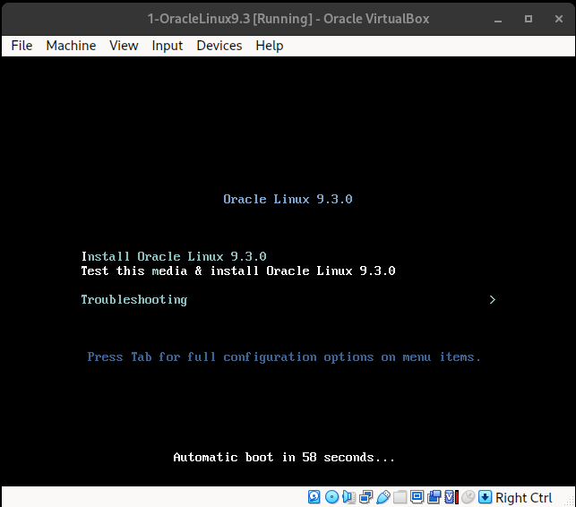

# Instalacao do Oracle Linux

1. Apos iniciar a VM, selecionar a opcao de teste da midia e instalacao

    

2. Apos teste da midia sera iniciado o processo de configuracao/instalacao onde sera apresentado a seguinte tela solicitando a definicao do idioma

    

3. Logo em seguida sera solicitado tambem as definicoes de data e horario

    

4. Apos isso sera apresentado o seguinte menu

    

    1. Neste caso sera dado inicio atraves da configuracao **Installation Destination**, selecionando em seguida a opcao **Custom**

        
    
    2. Montar o particionamento da seguinte forma

    - `/boot` => 2 G
    - `/swap` => 4 G
    - `/` => sera atribuido o restante 

        

        
      
    3. Em seguida na opcao **Root Password** para definicao da senha do usuario em questao

        
    
    4. E por fim sera criado o usuario que sera utilizado e definido sua senha em **User Creation**

        

5. Apos essas configuracoes basta selecionar a opcao **Begin Installation**

 

---

 

[**Ambiente**](../ambiente.md)

 