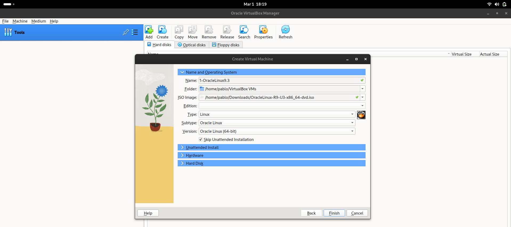
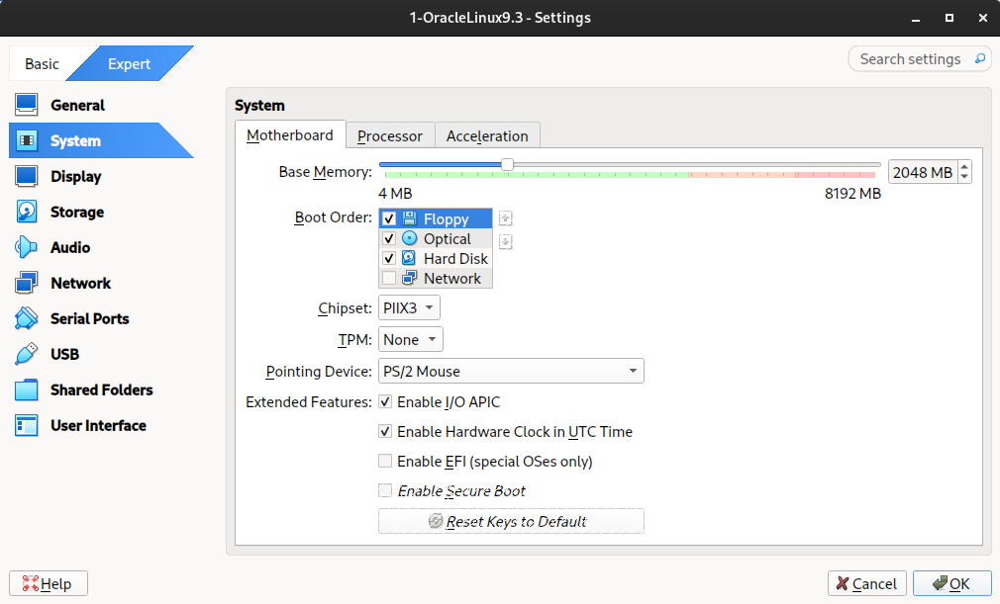
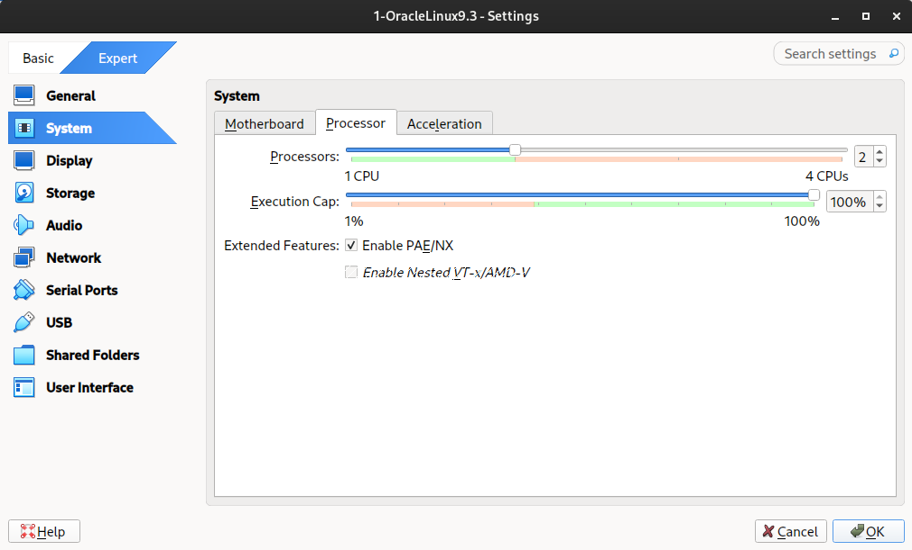
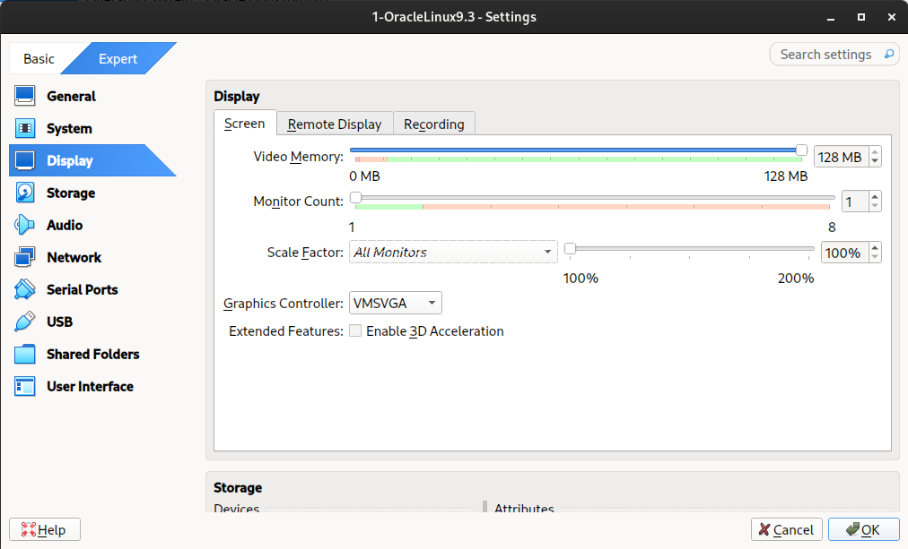
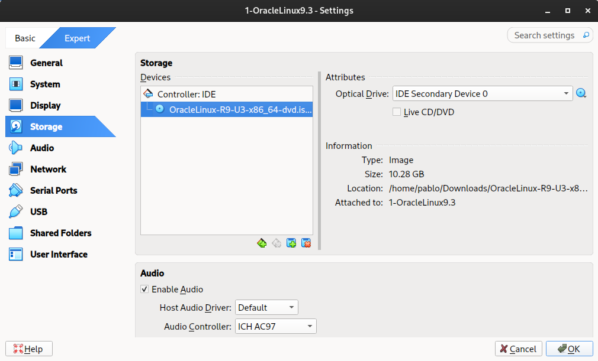

## Para configurar uma VM com o Oracle Linux 9.3 no VirtualBox de modo que a instalação ocorra em modo gráfico, siga estes passos:

**OBS: Neste exemplo fora utilizada uma configuracao extremamente basica pois a maquina que esta hospedando as VM's e literalmente um laptop da xuxa... Inclusive posteriormente elas foram reduzidas ainda mais, pois fora evitado a utilizacao das VM's atraves do ambiente grafico**

1. **Criar uma Máquina Virtual**  

   1. Abra o VirtualBox e va em **Machine > New** para criar uma nova máquina virtual.
   2. Nomeie a máquina.
   3. Escolha o tipo: "Linux".
   4. Versão: selecione "Red Hat (64-bit)" se for uma versão de 64 bits.
   5. Selecione a "iso" que sera utilizada
   6. Marque a opcao "Skip Unattended Installation"
   7. Finish

   

2. **Configurar Memória RAM**  

   1. Após criar a máquina, vá para **Settings**.
   2. Em **System > Motherboard**, defina a Memória Base para pelo menos 2048 MB (ou mais, se possível) por se tratar de uma instalacao atraves do modo grafico.

   

3. **Configurar Processador**  
   
    
   
   1. Em **System > Processor**, aumente o número de CPUs para ao menos 2, se o seu hardware permitir.

4. **Configurar Vídeo**  

   1. Vá para **System > Display**.
   2. Aumente a Memória de Vídeo para 128 MB.

   

5. **Configurar Armazenamento**  

   1. Na aba Armazenamento, adicione a imagem ISO do Oracle Linux 9.3 como um disco óptico.
   2. Certifique-se de que está na controladora IDE ou SATA, dependendo da sua configuração.

   

6. **Configurar Rede**  
   1. Em **Network**.
   2. Se nao estiver marcado marque a opcao **Enable Network Adapter**
   3. Escolha um adaptador (ex: "Adapter 1") e defina como **NAT** ou **Bridge Adapter**, dependendo de como você quer que a máquina virtual se comporte em sua rede, no meu caso utilizei o modo **Bridged Adapter**.
   4. Posteriormente basta selecionar o seu dispositivo de rede.

7. Configuracao concluida basta clicar em **OK**

8. **Iniciar a Máquina Virtual**  
   1. Após todas as configurações, clique em "Iniciar" para iniciar a instalação do S.O...

 

---

 

[**Ambiente**](../ambiente.md)

 